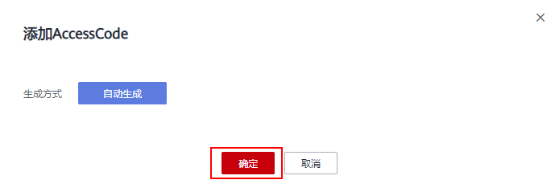

# 通过grafana查看AOM中的指标数据

## 前提条件

-   已购买弹性云服务器ECS，具体操作请参见[《弹性云服务器快速入门》](https://support.huaweicloud.com/qs-ecs/ecs_02_0009.html)。
-   已购买弹性公网IP，并绑定到购买的弹性云服务器ECS上，具体操作请参见[《弹性公网IP快速入门》](https://support.huaweicloud.com/qs-eip/eip_qs_0001.html)

## 操作步骤

1.  安装并启动Grafana，具体操作请参见[Grafana官方文档](https://grafana.com/docs/grafana/latest/installation/)。
2.  添加AccessCode。
    1.  登录AOM控制台，在左侧导航栏中选择“配置管理 \> 接入管理”。
    2.  在“认证管理”页签下，单击“添加AccessCode”。

        

        > **说明：** 
        >-   每个项目最多可创建2个AccessCode。
        >-   AccessCode是调用API的身份凭据，请您妥善保管。

    3.  在弹出的窗口，单击“确定”，添加AccessCode。

        

    4.  添加成功后，可在“认证管理”页签下，单击查看AccessCode。也可单击“删除”，删除AccessCode（**删除后无法恢复，请谨慎操作**）。

        

3.  配置Grafana。
    1.  登录Grafana。
    2.  在左侧菜单栏，选择“Configuration \> Data Source”，单击“Add data source”。

        

    3.  单击“Prometheus”，进入Prometheus配置页面。

        

    4.  参考下图示例配置参数。

        -   Password：将Password设置为[2](#li15901389517)中生成的AccessCode。
        -   User：aom\_access\_code。
        -   URL： \{URI-scheme\}://\{Endpoint\}/v1/\{project\_id\}
            -   URI-scheme：表示用于传输请求的协议，当前所有API均采用HTTPS协议。
            -   Endpoint为指定承载REST服务端点的服务器域名或IP，不同服务不同区域的Endpoint不同，您可以从[地区和终端节点](https://developer.huaweicloud.com/endpoint?AOM)中获取。例如AOM服务在“华北-北京一”区域的Endpoint为“aom.cn-north-1.myhuaweicloud.com”。
            -   project\_id 为项目的id，可在[我的凭证](https://support.huaweicloud.com/usermanual-ca/ca_01_0001.html)中的项目列表里查看。

        > **说明：** 
        >-   Auth下Basic auth和Skip TLS Verity的开关必须开启。
        >-   accesscode与projectid有对应关系，请在填写时确认匹配关系。

        

    5.  配置完成后，单击“Save&Test“，验证是否配置成功。

        配置成功即可使用Grafana配置Dashboards，查看指标数据。

        

