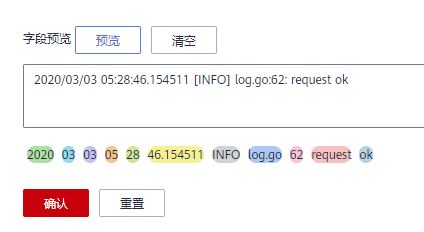

# 配置分词<a name="aom_02_0082"></a>

通过配置分词可将日志内容按照分词符切分为多个单词，在日志搜索时可使用切分后的单词进行搜索。初次使用时，AOM已默认进行了分词配置，默认配置的分词符为：

```
, '";=()[]{}@&<>/:\n\t\r
```

若默认分词符不能满足您的需求时，可按照如下操作进行自定义配置。

## 注意事项<a name="section20597312182911"></a>

分词配置只会对配置时间点以后生成的日志生效，之前的日志以之前配置的分词符进行处理。

## 配置分词<a name="section128132118353"></a>

1.  在左侧导航栏中选择“配置管理 \> 日志配置”，选择“分词配置”页签。
2.  配置分词。

    AOM提供了如下两种配置分词的方法。若同时使用了这两种配置方法，则分词符取并集。

    -   自定义分词符：单击，在文本框中输入分词符，单击。
    -   使用ASCII码：单击“添加特殊分词符”，参考[ASCII码对照表](#section15661144724914)输入ASCII值，单击。

3.  预览分词效果。

    在文本框中输入待预览的日志内容，单击“预览”。例如，分词符设置为**,\[\]**预览效果如下图所示：

    **图 1**  预览分词效果<a name="fig128022041133514"></a>  
    

4.  预览确认配置无误后单击“确认”。

    > **说明：** 
    >单击“重置”，可恢复到默认分词配置。默认分词符为：
    >```
    >, '";=()[]{}@&<>/:\n\t\r
    >```


## ASCII码对照表<a name="section15661144724914"></a>

**表 1**  ASCII码对照表

<a name="table14809151608"></a>
<table><thead align="left"><tr id="row88021514018"><th class="cellrowborder" valign="top" width="12.5%" id="mcps1.2.9.1.1"><p id="p84024916112"><a name="p84024916112"></a><a name="p84024916112"></a>ASCII值</p>
</th>
<th class="cellrowborder" valign="top" width="12.5%" id="mcps1.2.9.1.2"><p id="p8402109618"><a name="p8402109618"></a><a name="p8402109618"></a>控制字符</p>
</th>
<th class="cellrowborder" valign="top" width="12.5%" id="mcps1.2.9.1.3"><p id="p24021195116"><a name="p24021195116"></a><a name="p24021195116"></a>ASCII值</p>
</th>
<th class="cellrowborder" valign="top" width="12.5%" id="mcps1.2.9.1.4"><p id="p154031794110"><a name="p154031794110"></a><a name="p154031794110"></a>控制字符</p>
</th>
<th class="cellrowborder" valign="top" width="12.5%" id="mcps1.2.9.1.5"><p id="p3404119014"><a name="p3404119014"></a><a name="p3404119014"></a>ASCII值</p>
</th>
<th class="cellrowborder" valign="top" width="12.5%" id="mcps1.2.9.1.6"><p id="p1040417919115"><a name="p1040417919115"></a><a name="p1040417919115"></a>控制字符</p>
</th>
<th class="cellrowborder" valign="top" width="12.5%" id="mcps1.2.9.1.7"><p id="p1540419213"><a name="p1540419213"></a><a name="p1540419213"></a>ASCII值</p>
</th>
<th class="cellrowborder" valign="top" width="12.5%" id="mcps1.2.9.1.8"><p id="p4404891913"><a name="p4404891913"></a><a name="p4404891913"></a>控制字符</p>
</th>
</tr>
</thead>
<tbody><tr id="row08117152016"><td class="cellrowborder" valign="top" width="12.5%" headers="mcps1.2.9.1.1 "><p id="p78961357205"><a name="p78961357205"></a><a name="p78961357205"></a>0</p>
</td>
<td class="cellrowborder" valign="top" width="12.5%" headers="mcps1.2.9.1.2 "><p id="p18896175711016"><a name="p18896175711016"></a><a name="p18896175711016"></a>NUL（空字符）</p>
</td>
<td class="cellrowborder" valign="top" width="12.5%" headers="mcps1.2.9.1.3 "><p id="p7896757903"><a name="p7896757903"></a><a name="p7896757903"></a>32</p>
</td>
<td class="cellrowborder" valign="top" width="12.5%" headers="mcps1.2.9.1.4 "><p id="p124220293328"><a name="p124220293328"></a><a name="p124220293328"></a>空格</p>
</td>
<td class="cellrowborder" valign="top" width="12.5%" headers="mcps1.2.9.1.5 "><p id="p19896757904"><a name="p19896757904"></a><a name="p19896757904"></a>64</p>
</td>
<td class="cellrowborder" valign="top" width="12.5%" headers="mcps1.2.9.1.6 "><p id="p189616574016"><a name="p189616574016"></a><a name="p189616574016"></a>@</p>
</td>
<td class="cellrowborder" valign="top" width="12.5%" headers="mcps1.2.9.1.7 "><p id="p78966571105"><a name="p78966571105"></a><a name="p78966571105"></a>96</p>
</td>
<td class="cellrowborder" valign="top" width="12.5%" headers="mcps1.2.9.1.8 "><p id="p0896105716016"><a name="p0896105716016"></a><a name="p0896105716016"></a>`</p>
</td>
</tr>
<tr id="row7819151403"><td class="cellrowborder" valign="top" width="12.5%" headers="mcps1.2.9.1.1 "><p id="p1389655717013"><a name="p1389655717013"></a><a name="p1389655717013"></a>1</p>
</td>
<td class="cellrowborder" valign="top" width="12.5%" headers="mcps1.2.9.1.2 "><p id="p1289620571010"><a name="p1289620571010"></a><a name="p1289620571010"></a>SOH（标题开始）</p>
</td>
<td class="cellrowborder" valign="top" width="12.5%" headers="mcps1.2.9.1.3 "><p id="p108968571018"><a name="p108968571018"></a><a name="p108968571018"></a>33</p>
</td>
<td class="cellrowborder" valign="top" width="12.5%" headers="mcps1.2.9.1.4 "><p id="p989645712018"><a name="p989645712018"></a><a name="p989645712018"></a>!</p>
</td>
<td class="cellrowborder" valign="top" width="12.5%" headers="mcps1.2.9.1.5 "><p id="p489635712016"><a name="p489635712016"></a><a name="p489635712016"></a>65</p>
</td>
<td class="cellrowborder" valign="top" width="12.5%" headers="mcps1.2.9.1.6 "><p id="p1789612571008"><a name="p1789612571008"></a><a name="p1789612571008"></a>A</p>
</td>
<td class="cellrowborder" valign="top" width="12.5%" headers="mcps1.2.9.1.7 "><p id="p289685713017"><a name="p289685713017"></a><a name="p289685713017"></a>97</p>
</td>
<td class="cellrowborder" valign="top" width="12.5%" headers="mcps1.2.9.1.8 "><p id="p1389620577019"><a name="p1389620577019"></a><a name="p1389620577019"></a>a</p>
</td>
</tr>
<tr id="row1681111514019"><td class="cellrowborder" valign="top" width="12.5%" headers="mcps1.2.9.1.1 "><p id="p1689616571902"><a name="p1689616571902"></a><a name="p1689616571902"></a>2</p>
</td>
<td class="cellrowborder" valign="top" width="12.5%" headers="mcps1.2.9.1.2 "><p id="p5896115714018"><a name="p5896115714018"></a><a name="p5896115714018"></a>STX（正文开始）</p>
</td>
<td class="cellrowborder" valign="top" width="12.5%" headers="mcps1.2.9.1.3 "><p id="p198961157306"><a name="p198961157306"></a><a name="p198961157306"></a>34</p>
</td>
<td class="cellrowborder" valign="top" width="12.5%" headers="mcps1.2.9.1.4 "><p id="p188968579014"><a name="p188968579014"></a><a name="p188968579014"></a>"</p>
</td>
<td class="cellrowborder" valign="top" width="12.5%" headers="mcps1.2.9.1.5 "><p id="p28967571305"><a name="p28967571305"></a><a name="p28967571305"></a>66</p>
</td>
<td class="cellrowborder" valign="top" width="12.5%" headers="mcps1.2.9.1.6 "><p id="p1289610579013"><a name="p1289610579013"></a><a name="p1289610579013"></a>B</p>
</td>
<td class="cellrowborder" valign="top" width="12.5%" headers="mcps1.2.9.1.7 "><p id="p1589605719014"><a name="p1589605719014"></a><a name="p1589605719014"></a>98</p>
</td>
<td class="cellrowborder" valign="top" width="12.5%" headers="mcps1.2.9.1.8 "><p id="p198962574015"><a name="p198962574015"></a><a name="p198962574015"></a>b</p>
</td>
</tr>
<tr id="row8819158010"><td class="cellrowborder" valign="top" width="12.5%" headers="mcps1.2.9.1.1 "><p id="p1789614571803"><a name="p1789614571803"></a><a name="p1789614571803"></a>3</p>
</td>
<td class="cellrowborder" valign="top" width="12.5%" headers="mcps1.2.9.1.2 "><p id="p8896457208"><a name="p8896457208"></a><a name="p8896457208"></a>ETX（正文结束）</p>
</td>
<td class="cellrowborder" valign="top" width="12.5%" headers="mcps1.2.9.1.3 "><p id="p198961757306"><a name="p198961757306"></a><a name="p198961757306"></a>35</p>
</td>
<td class="cellrowborder" valign="top" width="12.5%" headers="mcps1.2.9.1.4 "><p id="p11896175711016"><a name="p11896175711016"></a><a name="p11896175711016"></a>#</p>
</td>
<td class="cellrowborder" valign="top" width="12.5%" headers="mcps1.2.9.1.5 "><p id="p28965571103"><a name="p28965571103"></a><a name="p28965571103"></a>67</p>
</td>
<td class="cellrowborder" valign="top" width="12.5%" headers="mcps1.2.9.1.6 "><p id="p208961057108"><a name="p208961057108"></a><a name="p208961057108"></a>C</p>
</td>
<td class="cellrowborder" valign="top" width="12.5%" headers="mcps1.2.9.1.7 "><p id="p17896557503"><a name="p17896557503"></a><a name="p17896557503"></a>99</p>
</td>
<td class="cellrowborder" valign="top" width="12.5%" headers="mcps1.2.9.1.8 "><p id="p7896757605"><a name="p7896757605"></a><a name="p7896757605"></a>c</p>
</td>
</tr>
<tr id="row1881215002"><td class="cellrowborder" valign="top" width="12.5%" headers="mcps1.2.9.1.1 "><p id="p1089619572019"><a name="p1089619572019"></a><a name="p1089619572019"></a>4</p>
</td>
<td class="cellrowborder" valign="top" width="12.5%" headers="mcps1.2.9.1.2 "><p id="p889614571305"><a name="p889614571305"></a><a name="p889614571305"></a>EOT（传输结束）</p>
</td>
<td class="cellrowborder" valign="top" width="12.5%" headers="mcps1.2.9.1.3 "><p id="p489613579019"><a name="p489613579019"></a><a name="p489613579019"></a>36</p>
</td>
<td class="cellrowborder" valign="top" width="12.5%" headers="mcps1.2.9.1.4 "><p id="p08961657301"><a name="p08961657301"></a><a name="p08961657301"></a>$</p>
</td>
<td class="cellrowborder" valign="top" width="12.5%" headers="mcps1.2.9.1.5 "><p id="p389619571205"><a name="p389619571205"></a><a name="p389619571205"></a>68</p>
</td>
<td class="cellrowborder" valign="top" width="12.5%" headers="mcps1.2.9.1.6 "><p id="p089620571204"><a name="p089620571204"></a><a name="p089620571204"></a>D</p>
</td>
<td class="cellrowborder" valign="top" width="12.5%" headers="mcps1.2.9.1.7 "><p id="p88961057209"><a name="p88961057209"></a><a name="p88961057209"></a>100</p>
</td>
<td class="cellrowborder" valign="top" width="12.5%" headers="mcps1.2.9.1.8 "><p id="p7896757709"><a name="p7896757709"></a><a name="p7896757709"></a>d</p>
</td>
</tr>
<tr id="row4822151102"><td class="cellrowborder" valign="top" width="12.5%" headers="mcps1.2.9.1.1 "><p id="p289655716010"><a name="p289655716010"></a><a name="p289655716010"></a>5</p>
</td>
<td class="cellrowborder" valign="top" width="12.5%" headers="mcps1.2.9.1.2 "><p id="p78966574013"><a name="p78966574013"></a><a name="p78966574013"></a>ENQ（询问字符）</p>
</td>
<td class="cellrowborder" valign="top" width="12.5%" headers="mcps1.2.9.1.3 "><p id="p189675717018"><a name="p189675717018"></a><a name="p189675717018"></a>37</p>
</td>
<td class="cellrowborder" valign="top" width="12.5%" headers="mcps1.2.9.1.4 "><p id="p13896155719012"><a name="p13896155719012"></a><a name="p13896155719012"></a>%</p>
</td>
<td class="cellrowborder" valign="top" width="12.5%" headers="mcps1.2.9.1.5 "><p id="p17896657304"><a name="p17896657304"></a><a name="p17896657304"></a>69</p>
</td>
<td class="cellrowborder" valign="top" width="12.5%" headers="mcps1.2.9.1.6 "><p id="p198964571007"><a name="p198964571007"></a><a name="p198964571007"></a>E</p>
</td>
<td class="cellrowborder" valign="top" width="12.5%" headers="mcps1.2.9.1.7 "><p id="p128963571009"><a name="p128963571009"></a><a name="p128963571009"></a>101</p>
</td>
<td class="cellrowborder" valign="top" width="12.5%" headers="mcps1.2.9.1.8 "><p id="p198965579012"><a name="p198965579012"></a><a name="p198965579012"></a>e</p>
</td>
</tr>
<tr id="row282515601"><td class="cellrowborder" valign="top" width="12.5%" headers="mcps1.2.9.1.1 "><p id="p7896155720012"><a name="p7896155720012"></a><a name="p7896155720012"></a>6</p>
</td>
<td class="cellrowborder" valign="top" width="12.5%" headers="mcps1.2.9.1.2 "><p id="p17896757101"><a name="p17896757101"></a><a name="p17896757101"></a>ACK（确认回应）</p>
</td>
<td class="cellrowborder" valign="top" width="12.5%" headers="mcps1.2.9.1.3 "><p id="p1589855712018"><a name="p1589855712018"></a><a name="p1589855712018"></a>38</p>
</td>
<td class="cellrowborder" valign="top" width="12.5%" headers="mcps1.2.9.1.4 "><p id="p38981057603"><a name="p38981057603"></a><a name="p38981057603"></a>&amp;</p>
</td>
<td class="cellrowborder" valign="top" width="12.5%" headers="mcps1.2.9.1.5 "><p id="p15898115720018"><a name="p15898115720018"></a><a name="p15898115720018"></a>70</p>
</td>
<td class="cellrowborder" valign="top" width="12.5%" headers="mcps1.2.9.1.6 "><p id="p1289813574012"><a name="p1289813574012"></a><a name="p1289813574012"></a>F</p>
</td>
<td class="cellrowborder" valign="top" width="12.5%" headers="mcps1.2.9.1.7 "><p id="p9898195718012"><a name="p9898195718012"></a><a name="p9898195718012"></a>102</p>
</td>
<td class="cellrowborder" valign="top" width="12.5%" headers="mcps1.2.9.1.8 "><p id="p78986577016"><a name="p78986577016"></a><a name="p78986577016"></a>f</p>
</td>
</tr>
<tr id="row198301420202"><td class="cellrowborder" valign="top" width="12.5%" headers="mcps1.2.9.1.1 "><p id="p178989571009"><a name="p178989571009"></a><a name="p178989571009"></a>7</p>
</td>
<td class="cellrowborder" valign="top" width="12.5%" headers="mcps1.2.9.1.2 "><p id="p158981857508"><a name="p158981857508"></a><a name="p158981857508"></a>BEL（响铃）</p>
</td>
<td class="cellrowborder" valign="top" width="12.5%" headers="mcps1.2.9.1.3 "><p id="p10899657702"><a name="p10899657702"></a><a name="p10899657702"></a>39</p>
</td>
<td class="cellrowborder" valign="top" width="12.5%" headers="mcps1.2.9.1.4 "><p id="p189975712015"><a name="p189975712015"></a><a name="p189975712015"></a>'</p>
</td>
<td class="cellrowborder" valign="top" width="12.5%" headers="mcps1.2.9.1.5 "><p id="p1089975714015"><a name="p1089975714015"></a><a name="p1089975714015"></a>71</p>
</td>
<td class="cellrowborder" valign="top" width="12.5%" headers="mcps1.2.9.1.6 "><p id="p78997571709"><a name="p78997571709"></a><a name="p78997571709"></a>G</p>
</td>
<td class="cellrowborder" valign="top" width="12.5%" headers="mcps1.2.9.1.7 "><p id="p68991957109"><a name="p68991957109"></a><a name="p68991957109"></a>103</p>
</td>
<td class="cellrowborder" valign="top" width="12.5%" headers="mcps1.2.9.1.8 "><p id="p10899557200"><a name="p10899557200"></a><a name="p10899557200"></a>g</p>
</td>
</tr>
<tr id="row1782713201605"><td class="cellrowborder" valign="top" width="12.5%" headers="mcps1.2.9.1.1 "><p id="p88990579018"><a name="p88990579018"></a><a name="p88990579018"></a>8</p>
</td>
<td class="cellrowborder" valign="top" width="12.5%" headers="mcps1.2.9.1.2 "><p id="p128991857007"><a name="p128991857007"></a><a name="p128991857007"></a>BS（退格）</p>
</td>
<td class="cellrowborder" valign="top" width="12.5%" headers="mcps1.2.9.1.3 "><p id="p58993571803"><a name="p58993571803"></a><a name="p58993571803"></a>40</p>
</td>
<td class="cellrowborder" valign="top" width="12.5%" headers="mcps1.2.9.1.4 "><p id="p1089945711012"><a name="p1089945711012"></a><a name="p1089945711012"></a>(</p>
</td>
<td class="cellrowborder" valign="top" width="12.5%" headers="mcps1.2.9.1.5 "><p id="p1889912577020"><a name="p1889912577020"></a><a name="p1889912577020"></a>72</p>
</td>
<td class="cellrowborder" valign="top" width="12.5%" headers="mcps1.2.9.1.6 "><p id="p38992579020"><a name="p38992579020"></a><a name="p38992579020"></a>H</p>
</td>
<td class="cellrowborder" valign="top" width="12.5%" headers="mcps1.2.9.1.7 "><p id="p389918573010"><a name="p389918573010"></a><a name="p389918573010"></a>104</p>
</td>
<td class="cellrowborder" valign="top" width="12.5%" headers="mcps1.2.9.1.8 "><p id="p1589918572003"><a name="p1589918572003"></a><a name="p1589918572003"></a>h</p>
</td>
</tr>
<tr id="row3826132017010"><td class="cellrowborder" valign="top" width="12.5%" headers="mcps1.2.9.1.1 "><p id="p158991557704"><a name="p158991557704"></a><a name="p158991557704"></a>9</p>
</td>
<td class="cellrowborder" valign="top" width="12.5%" headers="mcps1.2.9.1.2 "><p id="p198998571016"><a name="p198998571016"></a><a name="p198998571016"></a>HT（水平定位符号，制表符）</p>
</td>
<td class="cellrowborder" valign="top" width="12.5%" headers="mcps1.2.9.1.3 "><p id="p138991257207"><a name="p138991257207"></a><a name="p138991257207"></a>41</p>
</td>
<td class="cellrowborder" valign="top" width="12.5%" headers="mcps1.2.9.1.4 "><p id="p138992571104"><a name="p138992571104"></a><a name="p138992571104"></a>)</p>
</td>
<td class="cellrowborder" valign="top" width="12.5%" headers="mcps1.2.9.1.5 "><p id="p589911571505"><a name="p589911571505"></a><a name="p589911571505"></a>73</p>
</td>
<td class="cellrowborder" valign="top" width="12.5%" headers="mcps1.2.9.1.6 "><p id="p18990571011"><a name="p18990571011"></a><a name="p18990571011"></a>I</p>
</td>
<td class="cellrowborder" valign="top" width="12.5%" headers="mcps1.2.9.1.7 "><p id="p589955715020"><a name="p589955715020"></a><a name="p589955715020"></a>105</p>
</td>
<td class="cellrowborder" valign="top" width="12.5%" headers="mcps1.2.9.1.8 "><p id="p1389912577013"><a name="p1389912577013"></a><a name="p1389912577013"></a>i</p>
</td>
</tr>
<tr id="row1282572019017"><td class="cellrowborder" valign="top" width="12.5%" headers="mcps1.2.9.1.1 "><p id="p14899557502"><a name="p14899557502"></a><a name="p14899557502"></a>10</p>
</td>
<td class="cellrowborder" valign="top" width="12.5%" headers="mcps1.2.9.1.2 "><p id="p1689945716019"><a name="p1689945716019"></a><a name="p1689945716019"></a>LF（换行）</p>
</td>
<td class="cellrowborder" valign="top" width="12.5%" headers="mcps1.2.9.1.3 "><p id="p88990571006"><a name="p88990571006"></a><a name="p88990571006"></a>42</p>
</td>
<td class="cellrowborder" valign="top" width="12.5%" headers="mcps1.2.9.1.4 "><p id="p78991957105"><a name="p78991957105"></a><a name="p78991957105"></a>*</p>
</td>
<td class="cellrowborder" valign="top" width="12.5%" headers="mcps1.2.9.1.5 "><p id="p13899155720017"><a name="p13899155720017"></a><a name="p13899155720017"></a>74</p>
</td>
<td class="cellrowborder" valign="top" width="12.5%" headers="mcps1.2.9.1.6 "><p id="p489913570012"><a name="p489913570012"></a><a name="p489913570012"></a>J</p>
</td>
<td class="cellrowborder" valign="top" width="12.5%" headers="mcps1.2.9.1.7 "><p id="p9899125719018"><a name="p9899125719018"></a><a name="p9899125719018"></a>106</p>
</td>
<td class="cellrowborder" valign="top" width="12.5%" headers="mcps1.2.9.1.8 "><p id="p589919574012"><a name="p589919574012"></a><a name="p589919574012"></a>j</p>
</td>
</tr>
<tr id="row1782311201501"><td class="cellrowborder" valign="top" width="12.5%" headers="mcps1.2.9.1.1 "><p id="p1489919571703"><a name="p1489919571703"></a><a name="p1489919571703"></a>11</p>
</td>
<td class="cellrowborder" valign="top" width="12.5%" headers="mcps1.2.9.1.2 "><p id="p589913571606"><a name="p589913571606"></a><a name="p589913571606"></a>VT（垂直定位符号）</p>
</td>
<td class="cellrowborder" valign="top" width="12.5%" headers="mcps1.2.9.1.3 "><p id="p6899657208"><a name="p6899657208"></a><a name="p6899657208"></a>43</p>
</td>
<td class="cellrowborder" valign="top" width="12.5%" headers="mcps1.2.9.1.4 "><p id="p188991857208"><a name="p188991857208"></a><a name="p188991857208"></a>+</p>
</td>
<td class="cellrowborder" valign="top" width="12.5%" headers="mcps1.2.9.1.5 "><p id="p2089915710013"><a name="p2089915710013"></a><a name="p2089915710013"></a>75</p>
</td>
<td class="cellrowborder" valign="top" width="12.5%" headers="mcps1.2.9.1.6 "><p id="p1089905719015"><a name="p1089905719015"></a><a name="p1089905719015"></a>K</p>
</td>
<td class="cellrowborder" valign="top" width="12.5%" headers="mcps1.2.9.1.7 "><p id="p889945710012"><a name="p889945710012"></a><a name="p889945710012"></a>107</p>
</td>
<td class="cellrowborder" valign="top" width="12.5%" headers="mcps1.2.9.1.8 "><p id="p38998571107"><a name="p38998571107"></a><a name="p38998571107"></a>k</p>
</td>
</tr>
<tr id="row082292011019"><td class="cellrowborder" valign="top" width="12.5%" headers="mcps1.2.9.1.1 "><p id="p2899957704"><a name="p2899957704"></a><a name="p2899957704"></a>12</p>
</td>
<td class="cellrowborder" valign="top" width="12.5%" headers="mcps1.2.9.1.2 "><p id="p1689918571204"><a name="p1689918571204"></a><a name="p1689918571204"></a>FF（换页键）</p>
</td>
<td class="cellrowborder" valign="top" width="12.5%" headers="mcps1.2.9.1.3 "><p id="p4900145713015"><a name="p4900145713015"></a><a name="p4900145713015"></a>44</p>
</td>
<td class="cellrowborder" valign="top" width="12.5%" headers="mcps1.2.9.1.4 "><p id="p10900185717015"><a name="p10900185717015"></a><a name="p10900185717015"></a>,</p>
</td>
<td class="cellrowborder" valign="top" width="12.5%" headers="mcps1.2.9.1.5 "><p id="p090016571101"><a name="p090016571101"></a><a name="p090016571101"></a>76</p>
</td>
<td class="cellrowborder" valign="top" width="12.5%" headers="mcps1.2.9.1.6 "><p id="p2900185716015"><a name="p2900185716015"></a><a name="p2900185716015"></a>L</p>
</td>
<td class="cellrowborder" valign="top" width="12.5%" headers="mcps1.2.9.1.7 "><p id="p190011579019"><a name="p190011579019"></a><a name="p190011579019"></a>108</p>
</td>
<td class="cellrowborder" valign="top" width="12.5%" headers="mcps1.2.9.1.8 "><p id="p1990013571807"><a name="p1990013571807"></a><a name="p1990013571807"></a>l</p>
</td>
</tr>
<tr id="row128204201008"><td class="cellrowborder" valign="top" width="12.5%" headers="mcps1.2.9.1.1 "><p id="p1090020571908"><a name="p1090020571908"></a><a name="p1090020571908"></a>13</p>
</td>
<td class="cellrowborder" valign="top" width="12.5%" headers="mcps1.2.9.1.2 "><p id="p7900205716014"><a name="p7900205716014"></a><a name="p7900205716014"></a>CR（归位键）</p>
</td>
<td class="cellrowborder" valign="top" width="12.5%" headers="mcps1.2.9.1.3 "><p id="p2900185715015"><a name="p2900185715015"></a><a name="p2900185715015"></a>45</p>
</td>
<td class="cellrowborder" valign="top" width="12.5%" headers="mcps1.2.9.1.4 "><p id="p159001657509"><a name="p159001657509"></a><a name="p159001657509"></a>-</p>
</td>
<td class="cellrowborder" valign="top" width="12.5%" headers="mcps1.2.9.1.5 "><p id="p19900205713016"><a name="p19900205713016"></a><a name="p19900205713016"></a>77</p>
</td>
<td class="cellrowborder" valign="top" width="12.5%" headers="mcps1.2.9.1.6 "><p id="p13900105719013"><a name="p13900105719013"></a><a name="p13900105719013"></a>M</p>
</td>
<td class="cellrowborder" valign="top" width="12.5%" headers="mcps1.2.9.1.7 "><p id="p139002057207"><a name="p139002057207"></a><a name="p139002057207"></a>109</p>
</td>
<td class="cellrowborder" valign="top" width="12.5%" headers="mcps1.2.9.1.8 "><p id="p4900757803"><a name="p4900757803"></a><a name="p4900757803"></a>m</p>
</td>
</tr>
<tr id="row337172319016"><td class="cellrowborder" valign="top" width="12.5%" headers="mcps1.2.9.1.1 "><p id="p1690011571019"><a name="p1690011571019"></a><a name="p1690011571019"></a>14</p>
</td>
<td class="cellrowborder" valign="top" width="12.5%" headers="mcps1.2.9.1.2 "><p id="p15900145717015"><a name="p15900145717015"></a><a name="p15900145717015"></a>SO（取消变换）</p>
</td>
<td class="cellrowborder" valign="top" width="12.5%" headers="mcps1.2.9.1.3 "><p id="p1990015710019"><a name="p1990015710019"></a><a name="p1990015710019"></a>46</p>
</td>
<td class="cellrowborder" valign="top" width="12.5%" headers="mcps1.2.9.1.4 "><p id="p119001957307"><a name="p119001957307"></a><a name="p119001957307"></a>.</p>
</td>
<td class="cellrowborder" valign="top" width="12.5%" headers="mcps1.2.9.1.5 "><p id="p1990019571608"><a name="p1990019571608"></a><a name="p1990019571608"></a>78</p>
</td>
<td class="cellrowborder" valign="top" width="12.5%" headers="mcps1.2.9.1.6 "><p id="p39001571104"><a name="p39001571104"></a><a name="p39001571104"></a>N</p>
</td>
<td class="cellrowborder" valign="top" width="12.5%" headers="mcps1.2.9.1.7 "><p id="p2090013572008"><a name="p2090013572008"></a><a name="p2090013572008"></a>110</p>
</td>
<td class="cellrowborder" valign="top" width="12.5%" headers="mcps1.2.9.1.8 "><p id="p1090015571508"><a name="p1090015571508"></a><a name="p1090015571508"></a>n</p>
</td>
</tr>
<tr id="row153616231108"><td class="cellrowborder" valign="top" width="12.5%" headers="mcps1.2.9.1.1 "><p id="p15900205718019"><a name="p15900205718019"></a><a name="p15900205718019"></a>15</p>
</td>
<td class="cellrowborder" valign="top" width="12.5%" headers="mcps1.2.9.1.2 "><p id="p1490095714015"><a name="p1490095714015"></a><a name="p1490095714015"></a>SI（启用变换）</p>
</td>
<td class="cellrowborder" valign="top" width="12.5%" headers="mcps1.2.9.1.3 "><p id="p1090015574017"><a name="p1090015574017"></a><a name="p1090015574017"></a>47</p>
</td>
<td class="cellrowborder" valign="top" width="12.5%" headers="mcps1.2.9.1.4 "><p id="p1590018571807"><a name="p1590018571807"></a><a name="p1590018571807"></a>/</p>
</td>
<td class="cellrowborder" valign="top" width="12.5%" headers="mcps1.2.9.1.5 "><p id="p39003571209"><a name="p39003571209"></a><a name="p39003571209"></a>79</p>
</td>
<td class="cellrowborder" valign="top" width="12.5%" headers="mcps1.2.9.1.6 "><p id="p99001557406"><a name="p99001557406"></a><a name="p99001557406"></a>O</p>
</td>
<td class="cellrowborder" valign="top" width="12.5%" headers="mcps1.2.9.1.7 "><p id="p490035719010"><a name="p490035719010"></a><a name="p490035719010"></a>111</p>
</td>
<td class="cellrowborder" valign="top" width="12.5%" headers="mcps1.2.9.1.8 "><p id="p1090215572017"><a name="p1090215572017"></a><a name="p1090215572017"></a>o</p>
</td>
</tr>
<tr id="row103318231507"><td class="cellrowborder" valign="top" width="12.5%" headers="mcps1.2.9.1.1 "><p id="p199021457900"><a name="p199021457900"></a><a name="p199021457900"></a>16</p>
</td>
<td class="cellrowborder" valign="top" width="12.5%" headers="mcps1.2.9.1.2 "><p id="p890211571303"><a name="p890211571303"></a><a name="p890211571303"></a>DLE（跳出数据通讯）</p>
</td>
<td class="cellrowborder" valign="top" width="12.5%" headers="mcps1.2.9.1.3 "><p id="p189023576016"><a name="p189023576016"></a><a name="p189023576016"></a>48</p>
</td>
<td class="cellrowborder" valign="top" width="12.5%" headers="mcps1.2.9.1.4 "><p id="p59021757001"><a name="p59021757001"></a><a name="p59021757001"></a>0</p>
</td>
<td class="cellrowborder" valign="top" width="12.5%" headers="mcps1.2.9.1.5 "><p id="p890210571800"><a name="p890210571800"></a><a name="p890210571800"></a>80</p>
</td>
<td class="cellrowborder" valign="top" width="12.5%" headers="mcps1.2.9.1.6 "><p id="p59023577013"><a name="p59023577013"></a><a name="p59023577013"></a>P</p>
</td>
<td class="cellrowborder" valign="top" width="12.5%" headers="mcps1.2.9.1.7 "><p id="p19902175715010"><a name="p19902175715010"></a><a name="p19902175715010"></a>112</p>
</td>
<td class="cellrowborder" valign="top" width="12.5%" headers="mcps1.2.9.1.8 "><p id="p179025571108"><a name="p179025571108"></a><a name="p179025571108"></a>p</p>
</td>
</tr>
<tr id="row63212233019"><td class="cellrowborder" valign="top" width="12.5%" headers="mcps1.2.9.1.1 "><p id="p1390214571803"><a name="p1390214571803"></a><a name="p1390214571803"></a>17</p>
</td>
<td class="cellrowborder" valign="top" width="12.5%" headers="mcps1.2.9.1.2 "><p id="p990245711011"><a name="p990245711011"></a><a name="p990245711011"></a>DC1（设备控制1）</p>
</td>
<td class="cellrowborder" valign="top" width="12.5%" headers="mcps1.2.9.1.3 "><p id="p690285719018"><a name="p690285719018"></a><a name="p690285719018"></a>49</p>
</td>
<td class="cellrowborder" valign="top" width="12.5%" headers="mcps1.2.9.1.4 "><p id="p390219571304"><a name="p390219571304"></a><a name="p390219571304"></a>1</p>
</td>
<td class="cellrowborder" valign="top" width="12.5%" headers="mcps1.2.9.1.5 "><p id="p190210572017"><a name="p190210572017"></a><a name="p190210572017"></a>81</p>
</td>
<td class="cellrowborder" valign="top" width="12.5%" headers="mcps1.2.9.1.6 "><p id="p1490216571404"><a name="p1490216571404"></a><a name="p1490216571404"></a>Q</p>
</td>
<td class="cellrowborder" valign="top" width="12.5%" headers="mcps1.2.9.1.7 "><p id="p14902657707"><a name="p14902657707"></a><a name="p14902657707"></a>113</p>
</td>
<td class="cellrowborder" valign="top" width="12.5%" headers="mcps1.2.9.1.8 "><p id="p1590265710013"><a name="p1590265710013"></a><a name="p1590265710013"></a>q</p>
</td>
</tr>
<tr id="row8314235012"><td class="cellrowborder" valign="top" width="12.5%" headers="mcps1.2.9.1.1 "><p id="p2902657607"><a name="p2902657607"></a><a name="p2902657607"></a>18</p>
</td>
<td class="cellrowborder" valign="top" width="12.5%" headers="mcps1.2.9.1.2 "><p id="p89021357905"><a name="p89021357905"></a><a name="p89021357905"></a>DC2（设备控制2）</p>
</td>
<td class="cellrowborder" valign="top" width="12.5%" headers="mcps1.2.9.1.3 "><p id="p199022571505"><a name="p199022571505"></a><a name="p199022571505"></a>50</p>
</td>
<td class="cellrowborder" valign="top" width="12.5%" headers="mcps1.2.9.1.4 "><p id="p090218579012"><a name="p090218579012"></a><a name="p090218579012"></a>2</p>
</td>
<td class="cellrowborder" valign="top" width="12.5%" headers="mcps1.2.9.1.5 "><p id="p1390214572007"><a name="p1390214572007"></a><a name="p1390214572007"></a>82</p>
</td>
<td class="cellrowborder" valign="top" width="12.5%" headers="mcps1.2.9.1.6 "><p id="p159022571708"><a name="p159022571708"></a><a name="p159022571708"></a>R</p>
</td>
<td class="cellrowborder" valign="top" width="12.5%" headers="mcps1.2.9.1.7 "><p id="p1290320571102"><a name="p1290320571102"></a><a name="p1290320571102"></a>114</p>
</td>
<td class="cellrowborder" valign="top" width="12.5%" headers="mcps1.2.9.1.8 "><p id="p1890375719017"><a name="p1890375719017"></a><a name="p1890375719017"></a>r</p>
</td>
</tr>
<tr id="row32818231108"><td class="cellrowborder" valign="top" width="12.5%" headers="mcps1.2.9.1.1 "><p id="p690314571006"><a name="p690314571006"></a><a name="p690314571006"></a>19</p>
</td>
<td class="cellrowborder" valign="top" width="12.5%" headers="mcps1.2.9.1.2 "><p id="p12903175714010"><a name="p12903175714010"></a><a name="p12903175714010"></a>DC3（设备控制3）</p>
</td>
<td class="cellrowborder" valign="top" width="12.5%" headers="mcps1.2.9.1.3 "><p id="p1990310573017"><a name="p1990310573017"></a><a name="p1990310573017"></a>51</p>
</td>
<td class="cellrowborder" valign="top" width="12.5%" headers="mcps1.2.9.1.4 "><p id="p109031257406"><a name="p109031257406"></a><a name="p109031257406"></a>3</p>
</td>
<td class="cellrowborder" valign="top" width="12.5%" headers="mcps1.2.9.1.5 "><p id="p490320571304"><a name="p490320571304"></a><a name="p490320571304"></a>83</p>
</td>
<td class="cellrowborder" valign="top" width="12.5%" headers="mcps1.2.9.1.6 "><p id="p1390317574012"><a name="p1390317574012"></a><a name="p1390317574012"></a>S</p>
</td>
<td class="cellrowborder" valign="top" width="12.5%" headers="mcps1.2.9.1.7 "><p id="p19903155716012"><a name="p19903155716012"></a><a name="p19903155716012"></a>115</p>
</td>
<td class="cellrowborder" valign="top" width="12.5%" headers="mcps1.2.9.1.8 "><p id="p3903857509"><a name="p3903857509"></a><a name="p3903857509"></a>s</p>
</td>
</tr>
<tr id="row7268231703"><td class="cellrowborder" valign="top" width="12.5%" headers="mcps1.2.9.1.1 "><p id="p159038576011"><a name="p159038576011"></a><a name="p159038576011"></a>20</p>
</td>
<td class="cellrowborder" valign="top" width="12.5%" headers="mcps1.2.9.1.2 "><p id="p109031557506"><a name="p109031557506"></a><a name="p109031557506"></a>DC4（设备控制4）</p>
</td>
<td class="cellrowborder" valign="top" width="12.5%" headers="mcps1.2.9.1.3 "><p id="p129031857108"><a name="p129031857108"></a><a name="p129031857108"></a>52</p>
</td>
<td class="cellrowborder" valign="top" width="12.5%" headers="mcps1.2.9.1.4 "><p id="p6903145715017"><a name="p6903145715017"></a><a name="p6903145715017"></a>4</p>
</td>
<td class="cellrowborder" valign="top" width="12.5%" headers="mcps1.2.9.1.5 "><p id="p1690313571007"><a name="p1690313571007"></a><a name="p1690313571007"></a>84</p>
</td>
<td class="cellrowborder" valign="top" width="12.5%" headers="mcps1.2.9.1.6 "><p id="p29031857403"><a name="p29031857403"></a><a name="p29031857403"></a>T</p>
</td>
<td class="cellrowborder" valign="top" width="12.5%" headers="mcps1.2.9.1.7 "><p id="p3903557604"><a name="p3903557604"></a><a name="p3903557604"></a>116</p>
</td>
<td class="cellrowborder" valign="top" width="12.5%" headers="mcps1.2.9.1.8 "><p id="p5903457109"><a name="p5903457109"></a><a name="p5903457109"></a>t</p>
</td>
</tr>
<tr id="row16140725405"><td class="cellrowborder" valign="top" width="12.5%" headers="mcps1.2.9.1.1 "><p id="p190313571804"><a name="p190313571804"></a><a name="p190313571804"></a>21</p>
</td>
<td class="cellrowborder" valign="top" width="12.5%" headers="mcps1.2.9.1.2 "><p id="p6903957904"><a name="p6903957904"></a><a name="p6903957904"></a>NAK（确认失败回应）</p>
</td>
<td class="cellrowborder" valign="top" width="12.5%" headers="mcps1.2.9.1.3 "><p id="p6903125712019"><a name="p6903125712019"></a><a name="p6903125712019"></a>53</p>
</td>
<td class="cellrowborder" valign="top" width="12.5%" headers="mcps1.2.9.1.4 "><p id="p49035571001"><a name="p49035571001"></a><a name="p49035571001"></a>5</p>
</td>
<td class="cellrowborder" valign="top" width="12.5%" headers="mcps1.2.9.1.5 "><p id="p990395710011"><a name="p990395710011"></a><a name="p990395710011"></a>85</p>
</td>
<td class="cellrowborder" valign="top" width="12.5%" headers="mcps1.2.9.1.6 "><p id="p109034571805"><a name="p109034571805"></a><a name="p109034571805"></a>U</p>
</td>
<td class="cellrowborder" valign="top" width="12.5%" headers="mcps1.2.9.1.7 "><p id="p1190335714017"><a name="p1190335714017"></a><a name="p1190335714017"></a>117</p>
</td>
<td class="cellrowborder" valign="top" width="12.5%" headers="mcps1.2.9.1.8 "><p id="p1903165712010"><a name="p1903165712010"></a><a name="p1903165712010"></a>u</p>
</td>
</tr>
<tr id="row141386258016"><td class="cellrowborder" valign="top" width="12.5%" headers="mcps1.2.9.1.1 "><p id="p2090318571606"><a name="p2090318571606"></a><a name="p2090318571606"></a>22</p>
</td>
<td class="cellrowborder" valign="top" width="12.5%" headers="mcps1.2.9.1.2 "><p id="p490395717011"><a name="p490395717011"></a><a name="p490395717011"></a>SYN（同步用暂停）</p>
</td>
<td class="cellrowborder" valign="top" width="12.5%" headers="mcps1.2.9.1.3 "><p id="p18903195713017"><a name="p18903195713017"></a><a name="p18903195713017"></a>54</p>
</td>
<td class="cellrowborder" valign="top" width="12.5%" headers="mcps1.2.9.1.4 "><p id="p16903257902"><a name="p16903257902"></a><a name="p16903257902"></a>6</p>
</td>
<td class="cellrowborder" valign="top" width="12.5%" headers="mcps1.2.9.1.5 "><p id="p39039571504"><a name="p39039571504"></a><a name="p39039571504"></a>86</p>
</td>
<td class="cellrowborder" valign="top" width="12.5%" headers="mcps1.2.9.1.6 "><p id="p190315571703"><a name="p190315571703"></a><a name="p190315571703"></a>V</p>
</td>
<td class="cellrowborder" valign="top" width="12.5%" headers="mcps1.2.9.1.7 "><p id="p990335710016"><a name="p990335710016"></a><a name="p990335710016"></a>118</p>
</td>
<td class="cellrowborder" valign="top" width="12.5%" headers="mcps1.2.9.1.8 "><p id="p09038577012"><a name="p09038577012"></a><a name="p09038577012"></a>v</p>
</td>
</tr>
<tr id="row113782519015"><td class="cellrowborder" valign="top" width="12.5%" headers="mcps1.2.9.1.1 "><p id="p090317577020"><a name="p090317577020"></a><a name="p090317577020"></a>23</p>
</td>
<td class="cellrowborder" valign="top" width="12.5%" headers="mcps1.2.9.1.2 "><p id="p490310575014"><a name="p490310575014"></a><a name="p490310575014"></a>ETB（区块传输结束）</p>
</td>
<td class="cellrowborder" valign="top" width="12.5%" headers="mcps1.2.9.1.3 "><p id="p690317574018"><a name="p690317574018"></a><a name="p690317574018"></a>55</p>
</td>
<td class="cellrowborder" valign="top" width="12.5%" headers="mcps1.2.9.1.4 "><p id="p89031857701"><a name="p89031857701"></a><a name="p89031857701"></a>7</p>
</td>
<td class="cellrowborder" valign="top" width="12.5%" headers="mcps1.2.9.1.5 "><p id="p1390365714010"><a name="p1390365714010"></a><a name="p1390365714010"></a>87</p>
</td>
<td class="cellrowborder" valign="top" width="12.5%" headers="mcps1.2.9.1.6 "><p id="p590313574019"><a name="p590313574019"></a><a name="p590313574019"></a>W</p>
</td>
<td class="cellrowborder" valign="top" width="12.5%" headers="mcps1.2.9.1.7 "><p id="p1690319576011"><a name="p1690319576011"></a><a name="p1690319576011"></a>119</p>
</td>
<td class="cellrowborder" valign="top" width="12.5%" headers="mcps1.2.9.1.8 "><p id="p179036572010"><a name="p179036572010"></a><a name="p179036572010"></a>w</p>
</td>
</tr>
<tr id="row11351425206"><td class="cellrowborder" valign="top" width="12.5%" headers="mcps1.2.9.1.1 "><p id="p0903757303"><a name="p0903757303"></a><a name="p0903757303"></a>24</p>
</td>
<td class="cellrowborder" valign="top" width="12.5%" headers="mcps1.2.9.1.2 "><p id="p3904155710019"><a name="p3904155710019"></a><a name="p3904155710019"></a>CAN（取消）</p>
</td>
<td class="cellrowborder" valign="top" width="12.5%" headers="mcps1.2.9.1.3 "><p id="p29041157506"><a name="p29041157506"></a><a name="p29041157506"></a>56</p>
</td>
<td class="cellrowborder" valign="top" width="12.5%" headers="mcps1.2.9.1.4 "><p id="p149041857602"><a name="p149041857602"></a><a name="p149041857602"></a>8</p>
</td>
<td class="cellrowborder" valign="top" width="12.5%" headers="mcps1.2.9.1.5 "><p id="p1390418571016"><a name="p1390418571016"></a><a name="p1390418571016"></a>88</p>
</td>
<td class="cellrowborder" valign="top" width="12.5%" headers="mcps1.2.9.1.6 "><p id="p89042057308"><a name="p89042057308"></a><a name="p89042057308"></a>X</p>
</td>
<td class="cellrowborder" valign="top" width="12.5%" headers="mcps1.2.9.1.7 "><p id="p18904557107"><a name="p18904557107"></a><a name="p18904557107"></a>120</p>
</td>
<td class="cellrowborder" valign="top" width="12.5%" headers="mcps1.2.9.1.8 "><p id="p179048571702"><a name="p179048571702"></a><a name="p179048571702"></a>x</p>
</td>
</tr>
<tr id="row16133182519012"><td class="cellrowborder" valign="top" width="12.5%" headers="mcps1.2.9.1.1 "><p id="p190455718015"><a name="p190455718015"></a><a name="p190455718015"></a>25</p>
</td>
<td class="cellrowborder" valign="top" width="12.5%" headers="mcps1.2.9.1.2 "><p id="p179041057206"><a name="p179041057206"></a><a name="p179041057206"></a>EM（连接介质中断）</p>
</td>
<td class="cellrowborder" valign="top" width="12.5%" headers="mcps1.2.9.1.3 "><p id="p1190435718011"><a name="p1190435718011"></a><a name="p1190435718011"></a>57</p>
</td>
<td class="cellrowborder" valign="top" width="12.5%" headers="mcps1.2.9.1.4 "><p id="p139049571708"><a name="p139049571708"></a><a name="p139049571708"></a>9</p>
</td>
<td class="cellrowborder" valign="top" width="12.5%" headers="mcps1.2.9.1.5 "><p id="p1090455713012"><a name="p1090455713012"></a><a name="p1090455713012"></a>89</p>
</td>
<td class="cellrowborder" valign="top" width="12.5%" headers="mcps1.2.9.1.6 "><p id="p1890513572009"><a name="p1890513572009"></a><a name="p1890513572009"></a>Y</p>
</td>
<td class="cellrowborder" valign="top" width="12.5%" headers="mcps1.2.9.1.7 "><p id="p11905145714012"><a name="p11905145714012"></a><a name="p11905145714012"></a>121</p>
</td>
<td class="cellrowborder" valign="top" width="12.5%" headers="mcps1.2.9.1.8 "><p id="p139055571005"><a name="p139055571005"></a><a name="p139055571005"></a>y</p>
</td>
</tr>
<tr id="row141305253014"><td class="cellrowborder" valign="top" width="12.5%" headers="mcps1.2.9.1.1 "><p id="p10905857304"><a name="p10905857304"></a><a name="p10905857304"></a>26</p>
</td>
<td class="cellrowborder" valign="top" width="12.5%" headers="mcps1.2.9.1.2 "><p id="p199057571708"><a name="p199057571708"></a><a name="p199057571708"></a>SUB（替换）</p>
</td>
<td class="cellrowborder" valign="top" width="12.5%" headers="mcps1.2.9.1.3 "><p id="p15905155717016"><a name="p15905155717016"></a><a name="p15905155717016"></a>58</p>
</td>
<td class="cellrowborder" valign="top" width="12.5%" headers="mcps1.2.9.1.4 "><p id="p490575711016"><a name="p490575711016"></a><a name="p490575711016"></a>:</p>
</td>
<td class="cellrowborder" valign="top" width="12.5%" headers="mcps1.2.9.1.5 "><p id="p19052573014"><a name="p19052573014"></a><a name="p19052573014"></a>90</p>
</td>
<td class="cellrowborder" valign="top" width="12.5%" headers="mcps1.2.9.1.6 "><p id="p7905135710015"><a name="p7905135710015"></a><a name="p7905135710015"></a>Z</p>
</td>
<td class="cellrowborder" valign="top" width="12.5%" headers="mcps1.2.9.1.7 "><p id="p4906557806"><a name="p4906557806"></a><a name="p4906557806"></a>122</p>
</td>
<td class="cellrowborder" valign="top" width="12.5%" headers="mcps1.2.9.1.8 "><p id="p169061571017"><a name="p169061571017"></a><a name="p169061571017"></a>z</p>
</td>
</tr>
<tr id="row812802517011"><td class="cellrowborder" valign="top" width="12.5%" headers="mcps1.2.9.1.1 "><p id="p1990616577020"><a name="p1990616577020"></a><a name="p1990616577020"></a>27</p>
</td>
<td class="cellrowborder" valign="top" width="12.5%" headers="mcps1.2.9.1.2 "><p id="p4906057701"><a name="p4906057701"></a><a name="p4906057701"></a>ESC（跳出）</p>
</td>
<td class="cellrowborder" valign="top" width="12.5%" headers="mcps1.2.9.1.3 "><p id="p149061257905"><a name="p149061257905"></a><a name="p149061257905"></a>59</p>
</td>
<td class="cellrowborder" valign="top" width="12.5%" headers="mcps1.2.9.1.4 "><p id="p199065571601"><a name="p199065571601"></a><a name="p199065571601"></a>;</p>
</td>
<td class="cellrowborder" valign="top" width="12.5%" headers="mcps1.2.9.1.5 "><p id="p149063571900"><a name="p149063571900"></a><a name="p149063571900"></a>91</p>
</td>
<td class="cellrowborder" valign="top" width="12.5%" headers="mcps1.2.9.1.6 "><p id="p49069571206"><a name="p49069571206"></a><a name="p49069571206"></a>[</p>
</td>
<td class="cellrowborder" valign="top" width="12.5%" headers="mcps1.2.9.1.7 "><p id="p3906135711019"><a name="p3906135711019"></a><a name="p3906135711019"></a>123</p>
</td>
<td class="cellrowborder" valign="top" width="12.5%" headers="mcps1.2.9.1.8 "><p id="p14906145718016"><a name="p14906145718016"></a><a name="p14906145718016"></a>{</p>
</td>
</tr>
<tr id="row979502616017"><td class="cellrowborder" valign="top" width="12.5%" headers="mcps1.2.9.1.1 "><p id="p20906257903"><a name="p20906257903"></a><a name="p20906257903"></a>28</p>
</td>
<td class="cellrowborder" valign="top" width="12.5%" headers="mcps1.2.9.1.2 "><p id="p179071057609"><a name="p179071057609"></a><a name="p179071057609"></a>FS（文件分割符）</p>
</td>
<td class="cellrowborder" valign="top" width="12.5%" headers="mcps1.2.9.1.3 "><p id="p19907757108"><a name="p19907757108"></a><a name="p19907757108"></a>60</p>
</td>
<td class="cellrowborder" valign="top" width="12.5%" headers="mcps1.2.9.1.4 "><p id="p15907135712010"><a name="p15907135712010"></a><a name="p15907135712010"></a>&lt;</p>
</td>
<td class="cellrowborder" valign="top" width="12.5%" headers="mcps1.2.9.1.5 "><p id="p1690714571602"><a name="p1690714571602"></a><a name="p1690714571602"></a>92</p>
</td>
<td class="cellrowborder" valign="top" width="12.5%" headers="mcps1.2.9.1.6 "><p id="p189077571207"><a name="p189077571207"></a><a name="p189077571207"></a>/</p>
</td>
<td class="cellrowborder" valign="top" width="12.5%" headers="mcps1.2.9.1.7 "><p id="p4907135712018"><a name="p4907135712018"></a><a name="p4907135712018"></a>124</p>
</td>
<td class="cellrowborder" valign="top" width="12.5%" headers="mcps1.2.9.1.8 "><p id="p1590713577019"><a name="p1590713577019"></a><a name="p1590713577019"></a>|</p>
</td>
</tr>
<tr id="row187921026204"><td class="cellrowborder" valign="top" width="12.5%" headers="mcps1.2.9.1.1 "><p id="p1090745719016"><a name="p1090745719016"></a><a name="p1090745719016"></a>29</p>
</td>
<td class="cellrowborder" valign="top" width="12.5%" headers="mcps1.2.9.1.2 "><p id="p159075573013"><a name="p159075573013"></a><a name="p159075573013"></a>GS（组群分隔符）</p>
</td>
<td class="cellrowborder" valign="top" width="12.5%" headers="mcps1.2.9.1.3 "><p id="p59071857204"><a name="p59071857204"></a><a name="p59071857204"></a>61</p>
</td>
<td class="cellrowborder" valign="top" width="12.5%" headers="mcps1.2.9.1.4 "><p id="p990711574014"><a name="p990711574014"></a><a name="p990711574014"></a>=</p>
</td>
<td class="cellrowborder" valign="top" width="12.5%" headers="mcps1.2.9.1.5 "><p id="p1590720579018"><a name="p1590720579018"></a><a name="p1590720579018"></a>93</p>
</td>
<td class="cellrowborder" valign="top" width="12.5%" headers="mcps1.2.9.1.6 "><p id="p490735717019"><a name="p490735717019"></a><a name="p490735717019"></a>]</p>
</td>
<td class="cellrowborder" valign="top" width="12.5%" headers="mcps1.2.9.1.7 "><p id="p390717571609"><a name="p390717571609"></a><a name="p390717571609"></a>125</p>
</td>
<td class="cellrowborder" valign="top" width="12.5%" headers="mcps1.2.9.1.8 "><p id="p189076571607"><a name="p189076571607"></a><a name="p189076571607"></a>}</p>
</td>
</tr>
<tr id="row479019261807"><td class="cellrowborder" valign="top" width="12.5%" headers="mcps1.2.9.1.1 "><p id="p189075571507"><a name="p189075571507"></a><a name="p189075571507"></a>30</p>
</td>
<td class="cellrowborder" valign="top" width="12.5%" headers="mcps1.2.9.1.2 "><p id="p6907157503"><a name="p6907157503"></a><a name="p6907157503"></a>RS（记录分隔符）</p>
</td>
<td class="cellrowborder" valign="top" width="12.5%" headers="mcps1.2.9.1.3 "><p id="p6907195712015"><a name="p6907195712015"></a><a name="p6907195712015"></a>62</p>
</td>
<td class="cellrowborder" valign="top" width="12.5%" headers="mcps1.2.9.1.4 "><p id="p1890715719016"><a name="p1890715719016"></a><a name="p1890715719016"></a>&gt;</p>
</td>
<td class="cellrowborder" valign="top" width="12.5%" headers="mcps1.2.9.1.5 "><p id="p11907457404"><a name="p11907457404"></a><a name="p11907457404"></a>94</p>
</td>
<td class="cellrowborder" valign="top" width="12.5%" headers="mcps1.2.9.1.6 "><p id="p290715713016"><a name="p290715713016"></a><a name="p290715713016"></a>^</p>
</td>
<td class="cellrowborder" valign="top" width="12.5%" headers="mcps1.2.9.1.7 "><p id="p1907657104"><a name="p1907657104"></a><a name="p1907657104"></a>126</p>
</td>
<td class="cellrowborder" valign="top" width="12.5%" headers="mcps1.2.9.1.8 "><p id="p129076575010"><a name="p129076575010"></a><a name="p129076575010"></a>~</p>
</td>
</tr>
<tr id="row10788152613013"><td class="cellrowborder" valign="top" width="12.5%" headers="mcps1.2.9.1.1 "><p id="p18907185710013"><a name="p18907185710013"></a><a name="p18907185710013"></a>31</p>
</td>
<td class="cellrowborder" valign="top" width="12.5%" headers="mcps1.2.9.1.2 "><p id="p590785714010"><a name="p590785714010"></a><a name="p590785714010"></a>US（单元分隔符）</p>
</td>
<td class="cellrowborder" valign="top" width="12.5%" headers="mcps1.2.9.1.3 "><p id="p890719571901"><a name="p890719571901"></a><a name="p890719571901"></a>63</p>
</td>
<td class="cellrowborder" valign="top" width="12.5%" headers="mcps1.2.9.1.4 "><p id="p1790705711015"><a name="p1790705711015"></a><a name="p1790705711015"></a>?</p>
</td>
<td class="cellrowborder" valign="top" width="12.5%" headers="mcps1.2.9.1.5 "><p id="p10909105716010"><a name="p10909105716010"></a><a name="p10909105716010"></a>95</p>
</td>
<td class="cellrowborder" valign="top" width="12.5%" headers="mcps1.2.9.1.6 "><p id="p1890914571108"><a name="p1890914571108"></a><a name="p1890914571108"></a>_</p>
</td>
<td class="cellrowborder" valign="top" width="12.5%" headers="mcps1.2.9.1.7 "><p id="p290935716015"><a name="p290935716015"></a><a name="p290935716015"></a>127</p>
</td>
<td class="cellrowborder" valign="top" width="12.5%" headers="mcps1.2.9.1.8 "><p id="p1690912575017"><a name="p1690912575017"></a><a name="p1690912575017"></a>DEL（删除）</p>
</td>
</tr>
</tbody>
</table>

