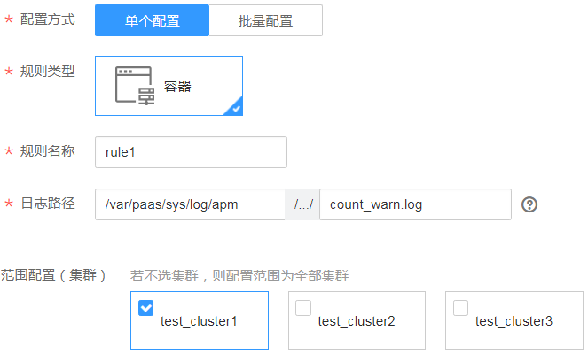

# 配置容器服务日志采集路径<a name="ZH-CN_TOPIC_0130543106"></a>

AOM支持容器服务日志采集，并展现在AOM界面中，以供您检索。使用该功能前首先要配置日志采集路径，配置方法详见如下操作。

## 注意事项<a name="section661319359393"></a>

-   ICAgent只采集\*.log、\*.trace和\*.out类型的日志文件。
-   使用集群方式（单个配置+批量配置）最多可配置20条日志采集路径，且该配置对集群下新增的服务也生效。
-   AOM默认会采集容器标准输出日志，您不用做任何配置。

## 配置方式介绍<a name="section9851578382"></a>

容器服务日志采集路径有如下两种配置方式，建议您选择其中一种使用。

-   **集群方式**：在容器服务创建完成后，在AOM界面以集群为单位同时对集群下的所有容器的日志采集路径进行配置。如果集群下容器服务的日志采集路径是相同的，推荐使用此方式。

    该配置方式分为单个配置和批量配置。单个配置一次只能配置一条日志采集路径，批量配置一次可配置多条日志采集路径。批量配置使用JSON格式，若您对JSON没有初步的了解，推荐您使用单个配置方式。操作详见[集群方式-单个配置（该功能于2019年1月31日下线）](#section179891631134913)和[集群方式-批量配置（该功能于2019年1月31日下线）](#section1381110186)。

    > **注意：**   
    >集群方式（包括单个配置和集群配置）于2019年1月31日下线，已有配置即将失效，请尽快前往CCE或CCI 界面进行配置，操作详见[单容器服务方式](#section20934195113)。  

-   **单容器服务方式**：在CCE、ServiceStage、CCI界面创建容器服务时，通过添加日志策略单独对指定的单个容器服务的日志采集路径进行配置。操作详见[单容器服务方式](#section20934195113)。

## 集群方式-单个配置（该功能于2019年1月31日下线）<a name="section179891631134913"></a>

1.  登录[应用运维管理](https://console.huaweicloud.com/aom/#/aom/ams/summary)。
2.  在左侧导航栏中选择“日志管理 \> 路径配置”，在“容器日志”页签中单击“配置”。
3.  配置方式选择“单个配置”，参考[表1](#table567955913453)配置相关参数，如下图所示。

    **图 1**  单个配置<a name="fig523711354612"></a>  
    

    **表 1**  参数说明

    <a name="table567955913453"></a>
    <table><thead align="left"><tr id="row136781259164516"><th class="cellrowborder" colspan="2" valign="top" id="mcps1.2.4.1.1"><p id="p5678135954518"><a name="p5678135954518"></a><a name="p5678135954518"></a>参数</p>
    </th>
    <th class="cellrowborder" valign="top" id="mcps1.2.4.1.2"><p id="p167816594456"><a name="p167816594456"></a><a name="p167816594456"></a>说明</p>
    </th>
    </tr>
    </thead>
    <tbody><tr id="row162205510493"><td class="cellrowborder" colspan="2" valign="top" headers="mcps1.2.4.1.1 "><p id="p1067835917455"><a name="p1067835917455"></a><a name="p1067835917455"></a>规则类型</p>
    </td>
    <td class="cellrowborder" valign="top" headers="mcps1.2.4.1.2 "><p id="p14678359114510"><a name="p14678359114510"></a><a name="p14678359114510"></a>目前仅支持容器类型。</p>
    </td>
    </tr>
    <tr id="row1067895984515"><td class="cellrowborder" colspan="2" valign="top" headers="mcps1.2.4.1.1 "><p id="p1767845984517"><a name="p1767845984517"></a><a name="p1767845984517"></a>规则名称</p>
    </td>
    <td class="cellrowborder" valign="top" headers="mcps1.2.4.1.2 "><p id="p245753105912"><a name="p245753105912"></a><a name="p245753105912"></a>用来标记一次路径配置操作。</p>
    <p id="p967813598458"><a name="p967813598458"></a><a name="p967813598458"></a>长度为1～64位字符，不能包含"$@#%&amp;'+;&lt;=&gt;?\特殊字符，不能重复，不能为空，配置成功后不可修改。</p>
    </td>
    </tr>
    <tr id="row96781759134514"><td class="cellrowborder" rowspan="2" valign="top" width="15%" headers="mcps1.2.4.1.1 "><p id="p3708171885210"><a name="p3708171885210"></a><a name="p3708171885210"></a>日志路径</p>
    <p id="p1356811315114"><a name="p1356811315114"></a><a name="p1356811315114"></a>（由目录名称和文件名称两部分组成）</p>
    </td>
    <td class="cellrowborder" valign="top" width="15%" headers="mcps1.2.4.1.1 "><p id="p156785596455"><a name="p156785596455"></a><a name="p156785596455"></a>目录名称</p>
    </td>
    <td class="cellrowborder" valign="top" width="70%" headers="mcps1.2.4.1.2 "><p id="p166784592453"><a name="p166784592453"></a><a name="p166784592453"></a>待采集的容器服务日志文件所在路径。</p>
    <p id="p10678185944512"><a name="p10678185944512"></a><a name="p10678185944512"></a>目录必须以/开头，至少为一级目录，ICAgent最多采集已配目录下的三级子目录。目录必须是实际存在的，否则配置无意义。</p>
    <p id="p767805984519"><a name="p767805984519"></a><a name="p767805984519"></a>例如，目录配置为/var/paas/sys/log/apm，文件名称为count_warn.log，若该目录下有4级子录/var/paas/sys/log/apm/<strong id="b967845954511"><a name="b967845954511"></a><a name="b967845954511"></a>debug/yilu/work/xig</strong>，则最多采集debug、yilu、work文件夹下的所有的名称为count_warn.log的日志文件，xig文件夹下即使有count_warn.log也不会被采集。</p>
    </td>
    </tr>
    <tr id="row12678145944511"><td class="cellrowborder" valign="top" headers="mcps1.2.4.1.1 "><p id="p106781459104516"><a name="p106781459104516"></a><a name="p106781459104516"></a>文件名称</p>
    </td>
    <td class="cellrowborder" valign="top" headers="mcps1.2.4.1.1 "><p id="p36121433121518"><a name="p36121433121518"></a><a name="p36121433121518"></a>待采集的容器服务日志文件名称。日志文件必须是实际存在的，否则配置无意义。该参数可配置也可不配置。</p>
    <a name="ul14678145910451"></a><a name="ul14678145910451"></a><ul id="ul14678145910451"><li>不配置：默认采集目录下所有的.log、.out、.trace文件。</li></ul>
    <a name="ul1667855916458"></a><a name="ul1667855916458"></a><ul id="ul1667855916458"><li>配置：文件名称必须以.log、.out、.trace结尾。文件名称支持通配符*，且在使用通配符*时，文件名称只支持配置为*.log、*.out或*.trace。</li></ul>
    </td>
    </tr>
    <tr id="row13679165915457"><td class="cellrowborder" colspan="2" valign="top" headers="mcps1.2.4.1.1 "><p id="p86781959134520"><a name="p86781959134520"></a><a name="p86781959134520"></a>配置范围（集群）</p>
    </td>
    <td class="cellrowborder" valign="top" headers="mcps1.2.4.1.2 "><p id="p659934881813"><a name="p659934881813"></a><a name="p659934881813"></a>容器服务所在集群，日志采集路径配置对集群下的所有容器服务均生效。该参数可配置也可不配置。</p>
    <a name="ul467915594457"></a><a name="ul467915594457"></a><ul id="ul467915594457"><li>不配置：默认采集所有集群的所有容器的日志。</li><li>配置：采集已配置集群的所有容器的日志。</li></ul>
    </td>
    </tr>
    </tbody>
    </table>

4.  单击“确认”。

## 集群方式-批量配置（该功能于2019年1月31日下线）<a name="section1381110186"></a>

1.  登录[应用运维管理](https://console.huaweicloud.com/aom/#/aom/ams/summary)。
2.  在左侧导航栏中选择“日志管理 \> 路径配置”，在“容器日志”页签中单击“配置”。
3.  配置方式选择“批量配置”，通过JSON格式的配置样例批量配置多个规则。

    在配置时可将配置样例拷贝到“配置内容”文本框中，并参考[表2](#table45113014148)修改对应的参数值，请注意配置样例只包含了一个规则，配置样例中最外层花括号\{\}包裹起来的内容即为一个规则。配置多个规则时，多个规则使用JSON数组表示，每一个规则为JSON数组的一个元素，数据结构为 \[\{规则a\}, \{规则b\}, \{规则c\}, ...\]。

    配置样例：

    ```
    [
        {
            "ruleName": "container_demo",
            "type": "container",
            "ruleContent": {
                "path": "/var/paas",
                "fileName": "test.log",
                "clusterNames": [
                    "test_cluster1",
                    "test_cluster2"
                ]
            }
        }
    ]
    ```

    **表 2**  参数说明

    <a name="table45113014148"></a>
    <table><thead align="left"><tr id="row450914031414"><th class="cellrowborder" valign="top" width="15%" id="mcps1.2.4.1.1"><p id="p350960131420"><a name="p350960131420"></a><a name="p350960131420"></a>参数</p>
    </th>
    <th class="cellrowborder" valign="top" width="15%" id="mcps1.2.4.1.2"><p id="p1509170111417"><a name="p1509170111417"></a><a name="p1509170111417"></a>含义</p>
    </th>
    <th class="cellrowborder" valign="top" width="70%" id="mcps1.2.4.1.3"><p id="p1050919019142"><a name="p1050919019142"></a><a name="p1050919019142"></a>说明</p>
    </th>
    </tr>
    </thead>
    <tbody><tr id="row15511130161415"><td class="cellrowborder" valign="top" width="15%" headers="mcps1.2.4.1.1 "><p id="p85091901146"><a name="p85091901146"></a><a name="p85091901146"></a>ruleName</p>
    </td>
    <td class="cellrowborder" valign="top" width="15%" headers="mcps1.2.4.1.2 "><p id="p1150915013148"><a name="p1150915013148"></a><a name="p1150915013148"></a>规则名称</p>
    </td>
    <td class="cellrowborder" valign="top" width="70%" headers="mcps1.2.4.1.3 "><p id="p131011545010"><a name="p131011545010"></a><a name="p131011545010"></a>用来标记一次路径配置操作。</p>
    <p id="p1509150131412"><a name="p1509150131412"></a><a name="p1509150131412"></a>长度为1～64位字符，不能包含"$@#%&amp;'+;&lt;=&gt;?\特殊字符，不能重复，不能为空，配置成功后不可修改。</p>
    </td>
    </tr>
    <tr id="row175111606143"><td class="cellrowborder" valign="top" width="15%" headers="mcps1.2.4.1.1 "><p id="p051190111417"><a name="p051190111417"></a><a name="p051190111417"></a>type</p>
    </td>
    <td class="cellrowborder" valign="top" width="15%" headers="mcps1.2.4.1.2 "><p id="p1511806144"><a name="p1511806144"></a><a name="p1511806144"></a>规则类型</p>
    </td>
    <td class="cellrowborder" valign="top" width="70%" headers="mcps1.2.4.1.3 "><p id="p145111802149"><a name="p145111802149"></a><a name="p145111802149"></a>目前仅支持容器类型，配置为container即可，如下所示：</p>
    <pre class="screen" id="screen1251119016146"><a name="screen1251119016146"></a><a name="screen1251119016146"></a>        "type": "container",</pre>
    </td>
    </tr>
    <tr id="row251150161413"><td class="cellrowborder" valign="top" width="15%" headers="mcps1.2.4.1.1 "><p id="p2511207144"><a name="p2511207144"></a><a name="p2511207144"></a>path</p>
    </td>
    <td class="cellrowborder" valign="top" width="15%" headers="mcps1.2.4.1.2 "><p id="p1951120191419"><a name="p1951120191419"></a><a name="p1951120191419"></a>目录名称</p>
    </td>
    <td class="cellrowborder" valign="top" width="70%" headers="mcps1.2.4.1.3 "><p id="p1451113091411"><a name="p1451113091411"></a><a name="p1451113091411"></a>待采集的容器服务日志文件所在路径。</p>
    <p id="p85112011419"><a name="p85112011419"></a><a name="p85112011419"></a>目录必须以/开头，至少为一级目录，ICAgent最多采集已配目录下的三级子目录。目录必须是实际存在的，否则配置无意义。</p>
    <p id="p1866375617"><a name="p1866375617"></a><a name="p1866375617"></a>例如，目录配置为/var/paas/sys/log/apm，文件名称为count_warn.log，若该目录下有4级子录/var/paas/sys/log/apm/<strong id="b15912379616"><a name="b15912379616"></a><a name="b15912379616"></a>debug/yilu/work/xig</strong>，则最多采集debug、yilu、work文件夹下的所有的名称为count_warn.log的日志文件，xig文件夹下即使有count_warn.log也不会被采集。</p>
    </td>
    </tr>
    <tr id="row175118051413"><td class="cellrowborder" valign="top" width="15%" headers="mcps1.2.4.1.1 "><p id="p1351114014146"><a name="p1351114014146"></a><a name="p1351114014146"></a>fileName</p>
    </td>
    <td class="cellrowborder" valign="top" width="15%" headers="mcps1.2.4.1.2 "><p id="p051117091411"><a name="p051117091411"></a><a name="p051117091411"></a>文件名称</p>
    </td>
    <td class="cellrowborder" valign="top" width="70%" headers="mcps1.2.4.1.3 "><p id="p3511206146"><a name="p3511206146"></a><a name="p3511206146"></a>待采集的容器服务日志文件名称。日志文件必须是实际存在的，否则配置无意义。该参数可配置也可不配置：</p>
    <a name="ul65115017148"></a><a name="ul65115017148"></a><ul id="ul65115017148"><li>不配置：值配置为空（如下所示），或直接删除"fileName"键值对，则默认采集目录下所有的.log、.out、.trace文件。</li></ul>
    <pre class="screen" id="screen1451120111419"><a name="screen1451120111419"></a><a name="screen1451120111419"></a>            "fileName": "",</pre>
    <a name="ul7511140181410"></a><a name="ul7511140181410"></a><ul id="ul7511140181410"><li>配置：文件名称必须以.log、.out、.trace结尾。文件名称支持通配符*，且在使用通配符*时，文件名称只支持配置为*.log、*.out或*.trace。</li></ul>
    </td>
    </tr>
    <tr id="row351118041413"><td class="cellrowborder" valign="top" width="15%" headers="mcps1.2.4.1.1 "><p id="p19511120141417"><a name="p19511120141417"></a><a name="p19511120141417"></a>clusterNames</p>
    </td>
    <td class="cellrowborder" valign="top" width="15%" headers="mcps1.2.4.1.2 "><p id="p1051120081411"><a name="p1051120081411"></a><a name="p1051120081411"></a>配置范围（集群）</p>
    </td>
    <td class="cellrowborder" valign="top" width="70%" headers="mcps1.2.4.1.3 "><p id="p27478380237"><a name="p27478380237"></a><a name="p27478380237"></a>容器服务所在集群，日志采集路径配置对集群下的所有容器服务均生效。该参数可配置也可不配置。</p>
    <a name="ul16511507148"></a><a name="ul16511507148"></a><ul id="ul16511507148"><li>不配置：值配置为空（如下所示），或直接删除"clusterNames"键值对，则默认采集所有集群的所有容器的日志。<pre class="screen" id="screen135119011144"><a name="screen135119011144"></a><a name="screen135119011144"></a>            "clusterNames": [
                ]</pre>
    </li><li>配置：采集已配置集群的所有容器的日志。<div class="p" id="p551130161415"><a name="p551130161415"></a><a name="p551130161415"></a>多个集群使用数组表示，数据结构为 ["集群a", "集群b", "集群c", ...]，如下所示：<pre class="screen" id="screen751190201411"><a name="screen751190201411"></a><a name="screen751190201411"></a>            "clusterNames": [
                    "test_cluster1",
                    "test_cluster2"
                ]</pre>
    </div>
    </li></ul>
    </td>
    </tr>
    </tbody>
    </table>

4.  （可选）单击“格式检查”，对JSON格式进行检查，格式无误后单击“确认”，完成配置。

    AOM支持对JSON格式进行一键检查，当输入JSON数据较长，一时无法判断是否有多或少输入符号导致AOM不能解析时，可单击“格式检查”，快速检查已配置的内容是否满足JSON格式要求。如果不满足JSON格式要求，可参考配置样例进行检查并修改。


## 单容器服务方式<a name="section20934195113"></a>

**在CCE中添加日志策略**

1.  在CCE中创建[工作负载](https://support.huaweicloud.com/usermanual-cce/cce_01_0006.html)时，添加容器后，展开“容器日志”页签。
2.  <a name="li1695533514484"></a>添加日志策略。

    单击“添加日志策略”，参考[表3](#table122391557164512)进行配置。下面以nginx为例，不同工作负载根据实际情况配置。

    **图 2**  在CCE中添加日志策略<a name="fig8705125317412"></a>  
    

    **表 3**  参数说明

    <a name="table122391557164512"></a>
    <table><thead align="left"><tr id="row11240165774516"><th class="cellrowborder" valign="top" width="22%" id="mcps1.2.3.1.1"><p id="p624011572452"><a name="p624011572452"></a><a name="p624011572452"></a>参数</p>
    </th>
    <th class="cellrowborder" valign="top" width="78%" id="mcps1.2.3.1.2"><p id="p12411757124515"><a name="p12411757124515"></a><a name="p12411757124515"></a>参数说明</p>
    </th>
    </tr>
    </thead>
    <tbody><tr id="row1811816384264"><td class="cellrowborder" valign="top" width="22%" headers="mcps1.2.3.1.1 "><p id="p2118133872618"><a name="p2118133872618"></a><a name="p2118133872618"></a>存储类型</p>
    </td>
    <td class="cellrowborder" valign="top" width="78%" headers="mcps1.2.3.1.2 "><p id="p2011883812614"><a name="p2011883812614"></a><a name="p2011883812614"></a>主机路径。</p>
    </td>
    </tr>
    <tr id="row224116579450"><td class="cellrowborder" valign="top" width="22%" headers="mcps1.2.3.1.1 "><p id="p32421257104520"><a name="p32421257104520"></a><a name="p32421257104520"></a>主机路径</p>
    </td>
    <td class="cellrowborder" valign="top" width="78%" headers="mcps1.2.3.1.2 "><p id="p421223311460"><a name="p421223311460"></a><a name="p421223311460"></a>容器内日志文件所在路径挂载到主机上的位置。</p>
    </td>
    </tr>
    <tr id="row2822323271"><td class="cellrowborder" colspan="2" valign="top" headers="mcps1.2.3.1.1 mcps1.2.3.1.2 "><p id="p194941367279"><a name="p194941367279"></a><a name="p194941367279"></a><strong id="b17502441102718"><a name="b17502441102718"></a><a name="b17502441102718"></a>添加容器挂载</strong></p>
    </td>
    </tr>
    <tr id="row4435182713449"><td class="cellrowborder" valign="top" width="22%" headers="mcps1.2.3.1.1 "><p id="p9437122716448"><a name="p9437122716448"></a><a name="p9437122716448"></a>挂载路径</p>
    </td>
    <td class="cellrowborder" valign="top" width="78%" headers="mcps1.2.3.1.2 "><a name="ol635984911279"></a><a name="ol635984911279"></a><ol id="ol635984911279"><li>单击“添加容器挂载”。</li><li>挂载路径：输入容器内日志文件所在路径。<div class="notice" id="note1267492310461"><a name="note1267492310461"></a><a name="note1267492310461"></a><span class="noticetitle"> 注意： </span><div class="noticebody"><a name="ul165191752914"></a><a name="ul165191752914"></a><ul id="ul165191752914"><li>请不要挂载在系统目录下，如“<strong id="b5518954912"><a name="b5518954912"></a><a name="b5518954912"></a>/</strong>”、“<strong id="b1751965596"><a name="b1751965596"></a><a name="b1751965596"></a>/var/run”</strong>等，会导致容器异常。建议挂载在空目录下，若目录不为空，请确保目录下无影响容器启动的文件，否则文件会被替换，导致容器启动异常，工作负载创建失败。</li><li>挂载高危目录的情况下 ，建议使用低权限账号启动，否则可能会造成宿主机高危文件被破坏。</li><li>AOM只采集最近修改过的前20个日志文件，且不采集子目录。</li><li>AOM只采集挂载路径下的“.log”、“.trace”、“.out”日志文件，您需要保证日志文件的后缀为“.log”、“.trace”或“.out”。</li></ul>
    </div></div>
    </li></ol>
    </td>
    </tr>
    <tr id="row5826242204417"><td class="cellrowborder" valign="top" width="22%" headers="mcps1.2.3.1.1 "><p id="p582644214414"><a name="p582644214414"></a><a name="p582644214414"></a>主机扩展路径</p>
    </td>
    <td class="cellrowborder" valign="top" width="78%" headers="mcps1.2.3.1.2 "><p id="p119580811225"><a name="p119580811225"></a><a name="p119580811225"></a>会在原先的“卷目录/子目录”中增加一个三级目录。使用户更方便获取单个Pod输出的文件。</p>
    <a name="ul187433181971"></a><a name="ul187433181971"></a><ul id="ul187433181971"><li>None：不配置拓展路径。</li><li>PodUID：Pod的ID。</li><li>PodName：Pod的名称。</li><li>PodUID/ContainerName：Pod的ID/容器名称。</li><li>PodName/ContainerName：Pod名称/容器名称。</li></ul>
    </td>
    </tr>
    <tr id="row17243857174519"><td class="cellrowborder" valign="top" width="22%" headers="mcps1.2.3.1.1 "><p id="p3243145764517"><a name="p3243145764517"></a><a name="p3243145764517"></a>日志转储</p>
    </td>
    <td class="cellrowborder" valign="top" width="78%" headers="mcps1.2.3.1.2 "><a name="ul18243057164511"></a><a name="ul18243057164511"></a><ul id="ul18243057164511"><li>设置：AOM每分钟扫描一次日志文件，当某个日志文件超过50MB时，会立即对其转储（转储时会在该日志文件所在的目录下生成一个新的zip文件。对于一个日志文件，AOM只保留最近生成的20个zip文件，当zip文件超过20个时，时间较早的zip文件会被删除），转储完成后AOM会将该日志文件清空。</li><li>不设置：若您在下拉列表框中选择“不设置”，则AOM不会对日志文件进行转储。</li></ul>
    </td>
    </tr>
    </tbody>
    </table>


**在ServiceStage中添加日志策略**

1.  在ServiceStage中[创建应用](https://support.huaweicloud.com/usermanual-servicestage/servicestage_user_0018.html)时，添加镜像后，单击“高级设置”，展开“容器日志”页签。
2.  添加日志策略。

    添加日志策略的方法和CCE相同，请参考[2](#li1695533514484)进行配置。


**在CCI中添加日志策略**

1.  在[创建负载](https://support.huaweicloud.com/usermanual-cci/cci_01_0011.html)时，选择镜像后，单击“高级设置”，展开“日志采集”页签。
2.  添加日志策略。

    单击“添加日志存储”，参考[表4](#table16252318174715)进行配置。

    **图 3**  在CCI中添加日志策略<a name="fig297723819296"></a>  
    

    **表 4**  参数说明

    <a name="table16252318174715"></a>
    <table><thead align="left"><tr id="row13252718184718"><th class="cellrowborder" valign="top" width="20%" id="mcps1.2.3.1.1"><p id="p19361142734713"><a name="p19361142734713"></a><a name="p19361142734713"></a>参数</p>
    </th>
    <th class="cellrowborder" valign="top" width="80%" id="mcps1.2.3.1.2"><p id="p1836132717477"><a name="p1836132717477"></a><a name="p1836132717477"></a>参数说明</p>
    </th>
    </tr>
    </thead>
    <tbody><tr id="row1225251874718"><td class="cellrowborder" valign="top" width="20%" headers="mcps1.2.3.1.1 "><p id="p8361152713474"><a name="p8361152713474"></a><a name="p8361152713474"></a>容器内日志路径</p>
    </td>
    <td class="cellrowborder" valign="top" width="80%" headers="mcps1.2.3.1.2 "><p id="p2361027164714"><a name="p2361027164714"></a><a name="p2361027164714"></a>日志存储挂载到容器内的挂载路径，需要保证服务的日志输出路径与该路径一致，这样日志才能写入到日志存储卷中。</p>
    <div class="notice" id="note036122720477"><a name="note036122720477"></a><a name="note036122720477"></a><span class="noticetitle"> 注意： </span><div class="noticebody"><a name="ul7377132711471"></a><a name="ul7377132711471"></a><ul id="ul7377132711471"><li>日志存储卷挂载后，会覆盖掉日志路径下已有的内容。请保证日志路径为一个独立的路径，否则原来的内容不可见。</li><li>AOM只采集最近修改过的前20个日志文件，且不采集子目录。</li><li>AOM只采集日志路径下的“.log”、“.trace”、“.out”日志文件，您需要保证日志文件的后缀为“.log”、“.trace”或“.out”。</li></ul>
    </div></div>
    </td>
    </tr>
    <tr id="row112521718204710"><td class="cellrowborder" valign="top" width="20%" headers="mcps1.2.3.1.1 "><p id="p133771627124714"><a name="p133771627124714"></a><a name="p133771627124714"></a>日志存储空间</p>
    </td>
    <td class="cellrowborder" valign="top" width="80%" headers="mcps1.2.3.1.2 "><p id="p1355171873119"><a name="p1355171873119"></a><a name="p1355171873119"></a>日志的存储空间大小。</p>
    <p id="p123771627134715"><a name="p123771627134715"></a><a name="p123771627134715"></a>AOM对日志卷中的日志按50MB进行防爆处理，AOM只保留最近生成的20个zip文件，当zip文件超过20个时，时间较早的zip文件会被删除。</p>
    </td>
    </tr>
    </tbody>
    </table>


## 查看容器服务日志<a name="section1599133244316"></a>

日志采集路径配置成功后，若已配置的路径下存在日志文件，则ICAgent会从已配置的路径中采集日志文件，采集大概需要1分钟，请您耐心等待。待采集完成后，您可执行如下操作：

-   **查看容器服务日志文件**

    在左侧导航栏中选择“日志管理 \> 日志文件”，在“服务”页签的下拉列表框中选择对应的集群和命名空间，左边的列表展示了在已选命名空间下该集群的服务，单击某个服务，即可查看其日志文件，如下图所示。详细操作请参见[查看日志文件](查看日志文件.md)。

    **图 4**  查看容器服务日志文件<a name="fig34381489368"></a>  
    

-   **查看容器服务日志并进行分析**

    在左侧导航栏中选择“日志管理 \> 日志搜索”，在“服务”页签中选择对应的集群与命名空间，选择某个服务及已配的文件名称，查看采集到的日志并进行分析。详细操作请参见[搜索日志](搜索日志.md)。

    **图 5**  查看容器服务日志并进行分析<a name="fig153993275819"></a>  
    


