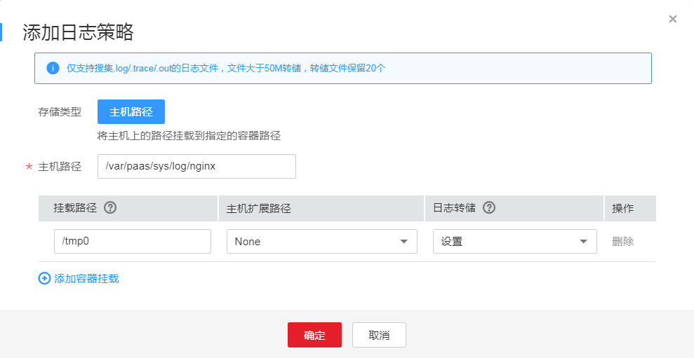
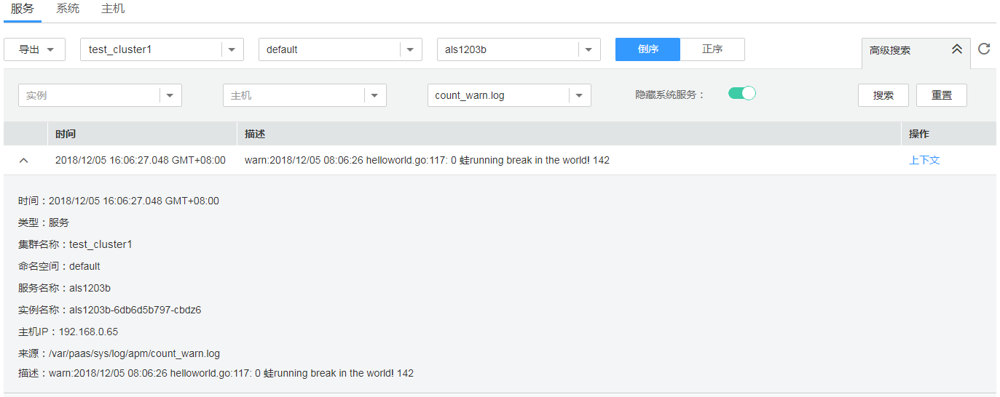

# 配置容器服务日志采集路径

AOM支持容器服务日志采集，并展现在AOM界面中，以供您检索。使用该功能前首先要配置日志采集路径，配置方法详见如下操作。

## 注意事项

-   ICAgent只采集\*.log、\*.trace和\*.out类型的文本日志文件。
-   AOM默认会采集容器标准输出日志，您不用做任何配置。

## 配置步骤

**在CCE中添加日志策略**

1.  在CCE中创建[工作负载](https://support.huaweicloud.com/usermanual-cce/cce_01_0006.html)时，添加容器后，展开“容器日志”页签。
2.  添加日志策略。

    单击“添加日志策略”，参考[表1](#table122391557164512)进行配置。下面以nginx为例，不同工作负载根据实际情况配置。

    **图 1**  在CCE中添加日志策略  
    

    **表 1**  参数说明

    
    <table><thead align="left"><tr id="row11240165774516"><th class="cellrowborder" valign="top" width="22%" id="mcps1.2.3.1.1">
参数

    </th>
    <th class="cellrowborder" valign="top" width="78%" id="mcps1.2.3.1.2">
参数说明

    </th>
    </tr>
    </thead>
    <tbody><tr id="row1811816384264"><td class="cellrowborder" valign="top" width="22%" headers="mcps1.2.3.1.1 ">
存储类型

    </td>
    <td class="cellrowborder" valign="top" width="78%" headers="mcps1.2.3.1.2 ">
主机路径。

    </td>
    </tr>
    <tr id="row224116579450"><td class="cellrowborder" valign="top" width="22%" headers="mcps1.2.3.1.1 ">
主机路径

    </td>
    <td class="cellrowborder" valign="top" width="78%" headers="mcps1.2.3.1.2 ">
容器内日志文件所在路径挂载到主机上的位置。

    </td>
    </tr>
    <tr id="row2822323271"><td class="cellrowborder" colspan="2" valign="top" headers="mcps1.2.3.1.1 mcps1.2.3.1.2 ">
<strong id="b17502441102718">添加容器挂载</strong>

    </td>
    </tr>
    <tr id="row4435182713449"><td class="cellrowborder" valign="top" width="22%" headers="mcps1.2.3.1.1 ">
挂载路径

    </td>
    <td class="cellrowborder" valign="top" width="78%" headers="mcps1.2.3.1.2 "><ol id="ol635984911279"><li>单击“添加容器挂载”。</li><li>挂载路径：输入容器内日志文件所在路径。
 须知： 
<ul id="ul165191752914"><li>请不要挂载在系统目录下，如“<strong id="b5518954912">/</strong>”、“<strong id="b1751965596">/var/run”</strong>等，会导致容器异常。建议挂载在空目录下，若目录不为空，请确保目录下无影响容器启动的文件，否则文件会被替换，导致容器启动异常，工作负载创建失败。</li><li>挂载高危目录的情况下 ，建议使用低权限账号启动，否则可能会造成宿主机高危文件被破坏。</li><li>AOM只采集最近修改过的前20个日志文件，且默认采集两级子目录。</li><li>AOM只采集挂载路径下的“.log”、“.trace”、“.out”文本日志文件。</li></ul>
    

    </li></ol>
    </td>
    </tr>
    <tr id="row5826242204417"><td class="cellrowborder" valign="top" width="22%" headers="mcps1.2.3.1.1 ">
主机扩展路径

    </td>
    <td class="cellrowborder" valign="top" width="78%" headers="mcps1.2.3.1.2 ">
会在原先的“卷目录/子目录”中增加一个三级目录。使用户更方便获取单个Pod输出的文件。

    <ul id="ul187433181971"><li>None：不配置拓展路径。</li><li>PodUID：Pod的ID。</li><li>PodName：Pod的名称。</li><li>PodUID/ContainerName：Pod的ID/容器名称。</li><li>PodName/ContainerName：Pod名称/容器名称。</li></ul>
    </td>
    </tr>
    <tr id="row17243857174519"><td class="cellrowborder" valign="top" width="22%" headers="mcps1.2.3.1.1 ">
日志转储

    </td>
    <td class="cellrowborder" valign="top" width="78%" headers="mcps1.2.3.1.2 "><ul id="ul18243057164511"><li>设置：AOM每分钟扫描一次日志文件，当某个日志文件超过50MB时，会立即对其转储（转储时会在该日志文件所在的目录下生成一个新的zip文件。对于一个日志文件，AOM只保留最近生成的20个zip文件，当zip文件超过20个时，时间较早的zip文件会被删除），转储完成后AOM会将该日志文件清空。</li><li>不设置：若您在下拉列表框中选择“不设置”，则AOM不会对日志文件进行转储。</li></ul>
    </td>
    </tr>
    </tbody>
    </table>

**在ServiceStage中添加日志策略**

1.  在ServiceStage中[创建应用](https://support.huaweicloud.com/usermanual-servicestage/servicestage_user_0111.html)时，添加镜像后，单击“高级设置”，展开“容器日志”页签。
2.  添加日志策略。

    添加日志策略的方法和CCE相同，请参考[2](#li1695533514484)进行配置。

**在CCI中添加日志策略**

1.  在[创建负载](https://support.huaweicloud.com/usermanual-cci/cci_01_0011.html)时，选择镜像后，单击“高级设置”，展开“日志采集”页签。
2.  添加日志策略。

    单击“添加日志存储”，参考[表2](#table16252318174715)进行配置。

    **图 2**  在CCI中添加日志策略  
    

    **表 2**  参数说明

    
    <table><thead align="left"><tr id="row13252718184718"><th class="cellrowborder" valign="top" width="20%" id="mcps1.2.3.1.1">
参数

    </th>
    <th class="cellrowborder" valign="top" width="80%" id="mcps1.2.3.1.2">
参数说明

    </th>
    </tr>
    </thead>
    <tbody><tr id="row1225251874718"><td class="cellrowborder" valign="top" width="20%" headers="mcps1.2.3.1.1 ">
容器内日志路径

    </td>
    <td class="cellrowborder" valign="top" width="80%" headers="mcps1.2.3.1.2 ">
日志存储挂载到容器内的挂载路径，需要保证服务的日志输出路径与该路径一致，这样日志才能写入到日志存储卷中。

    
 须知： 
<ul id="ul7377132711471"><li>日志存储卷挂载后，会覆盖掉日志路径下已有的内容。请保证日志路径为一个独立的路径，否则原来的内容不可见。</li><li>AOM只采集最近修改过的前20个日志文件，且不采集子目录。</li><li>AOM只采集日志路径下的“.log”、“.trace”、“.out”文本日志文件。</li></ul>
    

    </td>
    </tr>
    <tr id="row112521718204710"><td class="cellrowborder" valign="top" width="20%" headers="mcps1.2.3.1.1 ">
日志存储空间

    </td>
    <td class="cellrowborder" valign="top" width="80%" headers="mcps1.2.3.1.2 ">
日志的存储空间大小。

    
AOM对日志卷中的日志按50MB进行防爆处理，AOM只保留最近生成的20个zip文件，当zip文件超过20个时，时间较早的zip文件会被删除。

    </td>
    </tr>
    </tbody>
    </table>

## 查看容器服务日志

日志采集路径配置成功后，若已配置的路径下存在日志文件，则ICAgent会从已配置的路径中采集日志文件，采集大概需要1分钟，请您耐心等待。待采集完成后，您可执行如下操作：

-   **查看容器服务日志文件**

    在左侧导航栏中选择“日志管理 \> 日志文件”，在“服务”页签的下拉列表框中选择对应的集群和命名空间，左边的列表展示了在已选命名空间下该集群的服务，单击某个服务，即可查看其日志文件，如下图所示。详细操作请参见[查看日志文件](查看日志文件.md)。

    **图 3**  查看容器服务日志文件  
    

-   **查看容器服务日志并进行分析**

    在左侧导航栏中选择“日志管理 \> 日志搜索”，在“服务”页签中选择对应的集群与命名空间，选择某个服务及已配的文件名称，查看采集到的日志并进行分析。详细操作请参见[搜索日志](搜索日志.md)。

    **图 4**  查看容器服务日志并进行分析  
    

