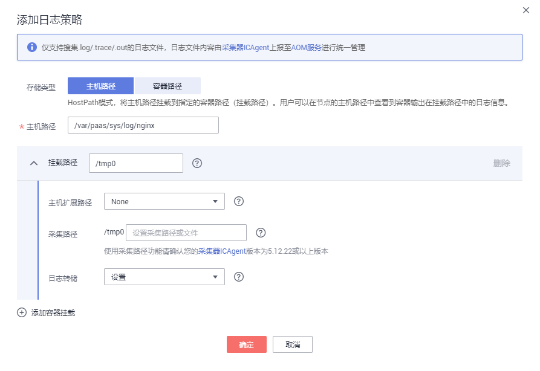

# 配置容器服务日志采集路径

当您需要ICAgent采集容器服务的日志文件时，您需要在创建服务时配置日志路径，ICAgent会根据您配置的日志路径采集日志文件，并针对容器服务按周期做防爆处理。配置完成后，您可参考[查看日志文件](查看日志文件.md)和[搜索日志](搜索日志.md)在AOM中查看和检索日志信息。

-   在CCE中创建容器服务时添加日志策略，操作详见[在CCE中添加日志策略](#section224711161419)。
-   在ServiceStage中创建容器服务时添加日志策略，操作详见[在ServiceStage中添加日志策略](#section5910193832716)。
-   在CCI中创建容器服务时添加日志策略，操作详见[在CCI中添加日志策略](#section1559932241916)。

> **注意：**   
>当您通过CCE、ServiceStage、CCI创建容器服务时，如果您没有添加日志策略，则AOM默认采集容器服务标准输出日志。  

## 在CCE中添加日志策略

1.  在CCE中创建[工作负载](https://support.huaweicloud.com/usermanual-cce/cce_01_0006.html)时，添加容器后，展开“容器日志”页签。
2.  添加日志策略。

    单击“添加日志策略”，参考[表1](#table122391557164512)进行配置。下面以nginx为例，不同工作负载根据实际情况配置。

    **图 1**  添加日志策略  
    

    **表 1**  添加日志策略

    
    <table><thead align="left"><tr id="row11240165774516"><th class="cellrowborder" valign="top" width="22%" id="mcps1.2.3.1.1">
参数

    </th>
    <th class="cellrowborder" valign="top" width="78%" id="mcps1.2.3.1.2">
参数说明

    </th>
    </tr>
    </thead>
    <tbody><tr id="row1811816384264"><td class="cellrowborder" valign="top" width="22%" headers="mcps1.2.3.1.1 ">
存储类型

    </td>
    <td class="cellrowborder" valign="top" width="78%" headers="mcps1.2.3.1.2 ">
主机路径。

    </td>
    </tr>
    <tr id="row224116579450"><td class="cellrowborder" valign="top" width="22%" headers="mcps1.2.3.1.1 ">
主机路径

    </td>
    <td class="cellrowborder" valign="top" width="78%" headers="mcps1.2.3.1.2 ">
容器内日志文件所在路径挂载到主机上的位置。

    </td>
    </tr>
    <tr id="row2822323271"><td class="cellrowborder" colspan="2" valign="top" headers="mcps1.2.3.1.1 mcps1.2.3.1.2 ">
<strong id="b17502441102718">添加容器挂载</strong>

    </td>
    </tr>
    <tr id="row4435182713449"><td class="cellrowborder" valign="top" width="22%" headers="mcps1.2.3.1.1 ">
挂载路径

    </td>
    <td class="cellrowborder" valign="top" width="78%" headers="mcps1.2.3.1.2 "><ol id="ol635984911279"><li>单击“添加容器挂载”。</li><li>挂载路径：输入容器内日志文件所在路径。
 注意： 
<ul id="ul165191752914"><li>请不要挂载在系统目录下，如“<strong id="b5518954912">/</strong>”、“<strong id="b1751965596">/var/run”</strong>等，会导致容器异常。建议挂载在空目录下，若目录不为空，请确保目录下无影响容器启动的文件，否则文件会被替换，导致容器启动异常，工作负载创建失败。</li><li>挂载高危目录的情况下 ，建议使用低权限账号启动，否则可能会造成宿主机高危文件被破坏。</li><li>AOM只采集最近修改过的前20个日志文件，且不采集子目录。</li><li>AOM只采集挂载路径下的“.log”、“.trace”、“.out”日志文件，您需要保证日志文件的后缀为“.log”、“.trace”或“.out”。</li></ul>
    

    </li></ol>
    </td>
    </tr>
    <tr id="row5826242204417"><td class="cellrowborder" valign="top" width="22%" headers="mcps1.2.3.1.1 ">
主机扩展路径

    </td>
    <td class="cellrowborder" valign="top" width="78%" headers="mcps1.2.3.1.2 ">
None：不配置拓展路径。

    </td>
    </tr>
    <tr id="row17243857174519"><td class="cellrowborder" valign="top" width="22%" headers="mcps1.2.3.1.1 ">
老化周期

    </td>
    <td class="cellrowborder" valign="top" width="78%" headers="mcps1.2.3.1.2 "><ul id="ul18243057164511"><li>Hourly、Daily、Weekly：AOM每分钟扫描一次日志文件，当某个日志文件超过50MB时，会立即对其转储（转储时会在该日志文件所在的目录下生成一个新的zip文件。对于一个日志文件，AOM只保留最近生成的20个zip文件，当zip文件超过20个时，时间较早的zip文件会被删除），转储完成后AOM会将该日志文件清空。</li><li>不设置：若您在下拉列表框中选择“不设置”，则AOM不会对日志文件进行转储。</li></ul>
    </td>
    </tr>
    </tbody>
    </table>

## 在ServiceStage中添加日志策略

1.  在ServiceStage中[创建应用](https://support.huaweicloud.com/usermanual-servicestage/servicestage_user_0018.html)时，添加镜像后，单击“高级设置”，展开“容器日志”页签。
2.  添加日志策略。

    添加日志策略的方法和CCE相同，请参考[在CCE中添加日志策略](#section224711161419)的[2](#li1695533514484)进行配置。

## 在CCI中添加日志策略

1.  在[创建负载](https://support.huaweicloud.com/usermanual-cci/cci_01_0011.html)时，选择镜像后，单击“高级设置”，展开“日志采集”页签。
2.  添加日志策略。

    单击“添加日志存储”，参考[表2](#table16252318174715)进行配置。

    **表 2**  添加日志策略

    
    <table><thead align="left"><tr id="row13252718184718"><th class="cellrowborder" valign="top" width="20%" id="mcps1.2.3.1.1">
参数

    </th>
    <th class="cellrowborder" valign="top" width="80%" id="mcps1.2.3.1.2">
参数说明

    </th>
    </tr>
    </thead>
    <tbody><tr id="row1225251874718"><td class="cellrowborder" valign="top" width="20%" headers="mcps1.2.3.1.1 ">
容器内日志路径

    </td>
    <td class="cellrowborder" valign="top" width="80%" headers="mcps1.2.3.1.2 ">
日志存储挂载到容器内的挂载路径，需要保证服务的日志输出路径与该路径一致，这样日志才能写入到日志存储卷中。

    
 注意： 
<ul id="ul7377132711471"><li>日志存储卷挂载后，会覆盖掉日志路径下已有的内容。请保证日志路径为一个独立的路径，否则原来的内容不可见。</li><li>AOM只采集最近修改过的前20个日志文件，且不采集子目录。</li><li>AOM只采集日志路径下的“.log”、“.trace”、“.out”日志文件，您需要保证日志文件的后缀为“.log”、“.trace”或“.out”。</li></ul>
    

    </td>
    </tr>
    <tr id="row112521718204710"><td class="cellrowborder" valign="top" width="20%" headers="mcps1.2.3.1.1 ">
日志存储空间

    </td>
    <td class="cellrowborder" valign="top" width="80%" headers="mcps1.2.3.1.2 ">
AOM对日志卷中的日志按50MB进行防爆处理，AOM只保留最近生成的20个zip文件，当zip文件超过20个时，时间较早的zip文件会被删除。

    </td>
    </tr>
    </tbody>
    </table>

