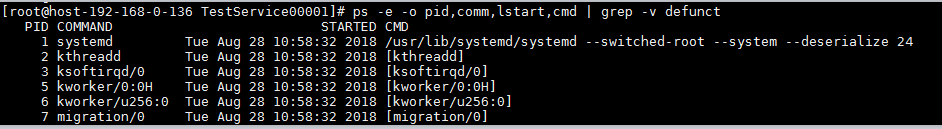
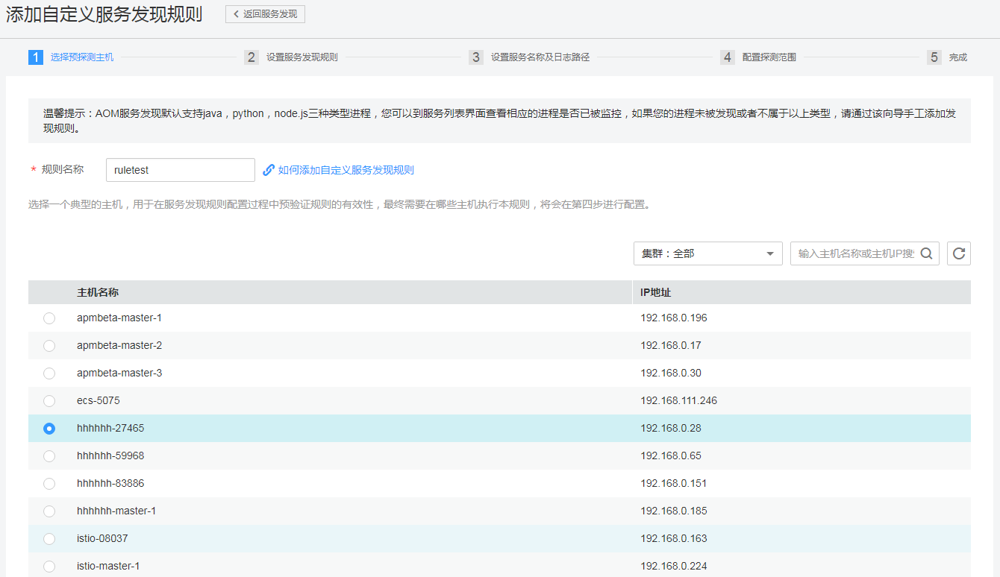
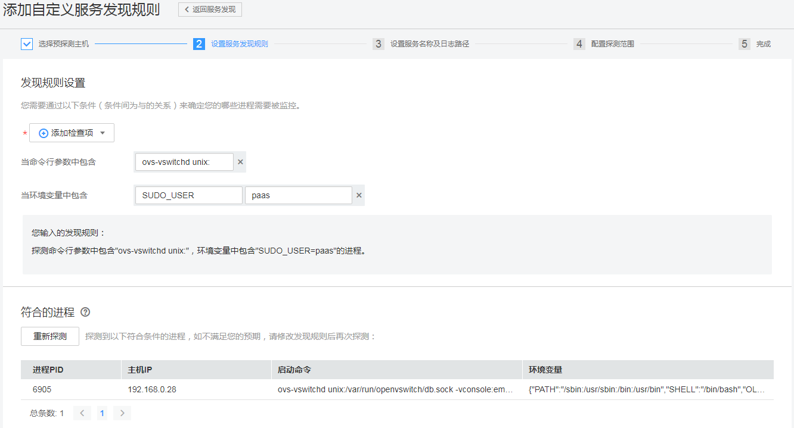
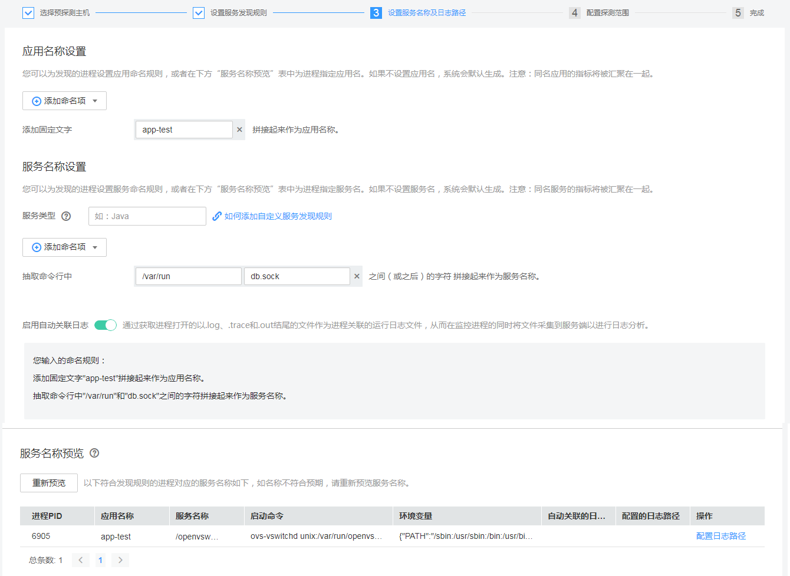
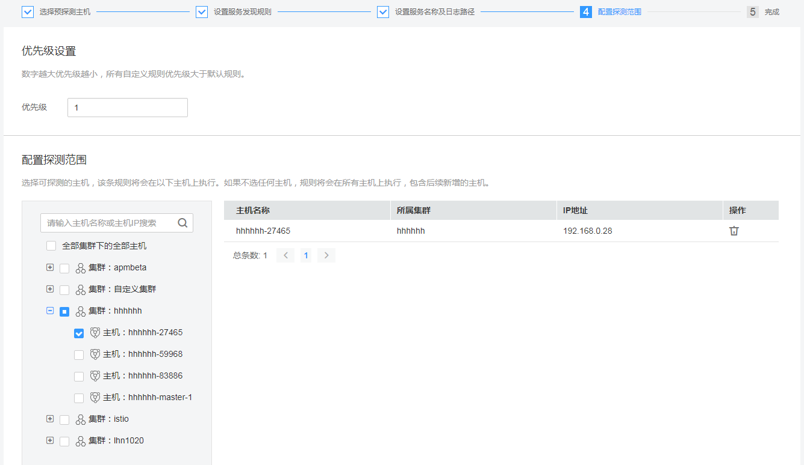

# 配置服务发现

服务发现即AOM发现服务并监控相关指标，将数据上报到界面中。从是否需要您来操作的角度区分服务发现方式，则有两种，自动发现和手动配置。

-   自动发现。分为如下两种：
    1.  通过ServiceStage或CCE使用指南部署应用，那么AOM将自动将数据上报至界面。
    2.  已经部署在Linux系统弹性云服务器上的语言为Java、node.js或python的应用，安装了ICAgent在服务器上，那么AOM将自动将数据上报至界面。[如何安装ICAgent](https://support.huaweicloud.com/usermanual-aom/aom_02_0012.html)

-   手动配置。手动配置实际上也是AOM自动发现，只不过您需要提前[安装ICAgent](https://support.huaweicloud.com/usermanual-aom/aom_02_0012.html)并配置发现规则。手动配置规则可发现的应用需要满足以下条件：
    1.  安装了应用的弹性云服务器是Linux操作系统。
    2.  安装了应用的弹性云服务器已经安装了ICAgent。（在左侧导航栏中选择“Agent管理”查看是否安装了ICAgent。如果界面中提示不存在ICAgent，则说明没有安装。[如何安装ICAgent](https://support.huaweicloud.com/usermanual-aom/aom_02_0012.html)）

本节介绍手动配置操作。目前可配置的规则有两种：一种是通过命令行参数是否包含指定关键字来决定是否匹配，如果匹配，通过指定key的内容为应用名，进程本身名称为进程名；另一种是通过环境变量来匹配，当进程环境变量中包含指定的环境变量时，获取对应的key的值为应用名，使用进程本身名称为进程名。AOM支持向导式服务发现，同时也支持服务发现过程自动发现实例日志。

-   过滤规则。

    采集器通过在您的主机上执行下面的命令，查询到所有的进程信息：

    ps -e -o pid,comm,lstart,cmd | grep -v defunct

    上面命令查询到的每一个进程信息，在解析服务名称之前，都通过下面的规则匹配，不需要过滤的进程，才会根据规则解析该进程的服务名称，解析到服务名称的进程会被最终在AOM的前台展示。

    

    过滤规则：

    1.  命令行以'\['开头，'\]'结尾的进程，不会在AOM前台展示；
    2.  命令行以'\('开头，'\)'结尾的进程，不会在AOM前台展示；
    3.  命令行为-bash的进程，不会在AOM前台展示；
    4.  command为\["sh", "bash", "ksh", "csh", "pdksh"\]之一的，需要进一步进行服务名称解析，解析到服务名称的，会在AOM前台展示；
    5.  命令行以/user/sbin/或/user/bin/或/sbin/开头的进程，不会在AOM前台展示；
    6.  command为\["docker-containe", "vi", "vim", "pause", "sshd", "ps", "sleep", "grep", "tailf", "tail", "systemd-udevd"\]之一的进程，不会在AOM前台展示；
    7.  其它情况，需要进一步进行服务名称解析，解析到服务名称的，会在AOM前台展示。

## 配置应用发现规则

1.  登录[应用运维管理](https://console.huaweicloud.com/aom/#/aom/ams/summary)。
2.  在左侧导航栏中选择“应用监控”\>“服务发现”。

    在服务发现主界面的自定义发现规则列表中显示的是已配置好的服务发现规则，其中存在一条默认规则，该条规则将会在所有主机上执行，包含后续新增的主机，并且仅支持启停操作，不支持修改和删除操作。

    > **说明：**   
    >默认规则的规则内容：  
    >进程command名称为java，服务名依次按照优先级从命令行中-Dapm\_tier=的值、进程环境变量PAAS\_APP\_NAME的值、命令行中的jar包名称，命令行中主类名称、命令行中第一个非-开头的关键字获取; 应用名优先取命令行中-Dapm\_application=的值，其次取进程环境变量PAAS\_MONITORING\_GROUP的值，未获取到则使用默认值unknownapplicationname。  
    >进程command名称为python，则取命令行中第一个py/pyc脚本名称作为服务名；应用名优先取命令行中-Dapm\_application=的值，其次取进程环境变量PAAS\_MONITORING\_GROUP的值，未获取到则使用默认值unknownapplicationname。  
    >进程command名称为node，则取命令行中第一个js脚本名称作为服务名；应用名优先取命令行中-Dapm\_application=的值，其次取进程环境变量PAAS\_MONITORING\_GROUP的值，未获取到则使用默认值unknownapplicationname。  

3.  单击“添加自定义服务发现规则”，进入添加自定义服务发现规则界面进行配置服务发现规则。
4.  选择预探测主机
    1.  根据您应用所属的类型，输入规则名称为：ruletest。
    2.  选择一个典型的主机为：hhhhhh-27465，用于在服务发现规则配置过程中预验证规则的有效性，最终在哪些主机上执行本规则，将会在后续配置中进行。完成后可单击“下一步”。

        

5.  设置服务发现规则
    1.  单击“添加检查项”，使满足检查项的进程能被AOM发现。为了可以精准的探测到符合您预期的进程，建议您在添加检查项时，填写进程的独有特征，即填写更容易识别出预期进程的关键字作为检查项。

        您至少要添加一条检查项，检查项您最多可添加5条。当有多条检查项时，所有检查项同时满足，AOM才能发现进程。

        如[图1](#fig183288514504)所示，命令行参数包含“ovs-vswitchd unix:”，且环境变量中包含“SUDO\_USER=paas”的进程，均会被AOM发现。

    2.  “添加检查项”完成后，需要单击“开始探测”查找符合的进程，如果20s后未探测到符合条件的进程，您需要修改发现规则后继续探测。如果探测到符合的进程，将可进入下一步的操作，否则不能进入后续操作。

        **图 1**  设置服务发现规则  
        

6.  设置服务名称及日志路径
    1.  单击“添加命名项”，为已发现的进程设置应用名称规则，或者在下方“服务名称预览”表中为进程指定应用名。如果不设置应用名，系统会默认生成。当您添加了多条命名项时，所有命名项将拼接在一起作为进程的应用名称，同名应用的指标将被汇聚在一起。

        如[图2 设置应用名称和服务名称](#fig7416134461911)所示，添加固定文字"app-test"拼接起来作为应用名称。

    2.  单击“添加命名项”，为已发现的进程设置服务名称规则，或者在下方“服务名称预览”表中为进程指定服务名。如果不设置服务名，系统会默认生成。当您添加了多条命名项时，所有命名项将拼接在一起作为进程的服务名称，同名服务的指标将被汇聚在一起。

        如[图2 设置应用名称和服务名称](#fig7416134461911)所示，抽取命令行中"/var/run"和"db.sock"之间的字符拼接起来作为服务名称。

    3.  开启“启用自动关联日志”，通过获取进程打开的以.log 、 .trace和.out 结尾的文件信息作为进程关联的运行日志文件，从而在监控进程的同时将文件采集到服务端以进行日志分析。默认开启此功能，如果您不需要可自行关闭，并且在服务名称预览表格中不会出现关于日志的列表。
    4.  预览应用名称为：app-test，预览服务名称为：/openvswitch/。

        该应用名称和服务名称名称也可在“服务名称预览”表中对其重新命名，命名规则请查看提示信息。

        **图 2**  设置应用名称和服务名称  
        

    5.  配置日志路径

        如果您已开启“启用自动关联日志”，在服务名称预览表格中的操作列单击“配置日志路径”，对已发现的应用名称、服务名称和日志路径与该条进程的命令行参数进行绑定。

7.  配置探测范围

    可以对规则设置优先级，优先使用哪个规则发现服务。输入优先级为1。

    选择可探测的主机，即已配置规则将会在哪个主机上执行，如果不选任何主机，规则将会在所有主机上执行，包含后续新增的主机。

    

8.  单击“添加”，完成配置。AOM会采集进程的指标数据。

    返回到服务发现界面，上述已配置的规则已在规则列表中呈现。

9.  等待大约两分钟后，您可以在左侧导航栏中选择“应用监控 \> 服务列表”，在集群下拉列表框中选择“hhhhhh-27465”，找到已被监控的“/openvswitch/”服务。

## 更多服务发现规则操作

<table><thead align="left"><tr id="row17219114119268"><th class="cellrowborder" valign="top" width="20%" id="mcps1.1.3.1.1">
操作

</th>
<th class="cellrowborder" valign="top" width="80%" id="mcps1.1.3.1.2">
说明

</th>
</tr>
</thead>
<tbody><tr id="row14819216131817"><td class="cellrowborder" valign="top" width="20%" headers="mcps1.1.3.1.1 ">
启停服务发现规则

</td>
<td class="cellrowborder" valign="top" width="80%" headers="mcps1.1.3.1.2 ">
单击“操作”列的“启用”，启用服务发现规则。

单击“操作”列的“停用”，停用服务发现规则。停用后，AOM将不会采集进程的指标数据。

</td>
</tr>
<tr id="row1532855313308"><td class="cellrowborder" valign="top" width="20%" headers="mcps1.1.3.1.1 ">
删除服务发现规则

</td>
<td class="cellrowborder" valign="top" width="80%" headers="mcps1.1.3.1.2 ">
单击“操作”列的“删除”，可删除服务发现规则。默认规则不支持删除操作。

</td>
</tr>
<tr id="row19219204172614"><td class="cellrowborder" valign="top" width="20%" headers="mcps1.1.3.1.1 ">
修改服务发现规则

</td>
<td class="cellrowborder" valign="top" width="80%" headers="mcps1.1.3.1.2 ">
单击“操作”列的“修改”，可修改服务发现规则。默认规则不支持修改操作。

</td>
</tr>
<tr id="row4942141720249"><td class="cellrowborder" valign="top" width="20%" headers="mcps1.1.3.1.1 ">
查看规则详情

</td>
<td class="cellrowborder" valign="top" width="80%" headers="mcps1.1.3.1.2 ">
单击“规则名称”列的某个规则名称，可查看其规则设置的详细内容。

</td>
</tr>
</tbody>
</table>

