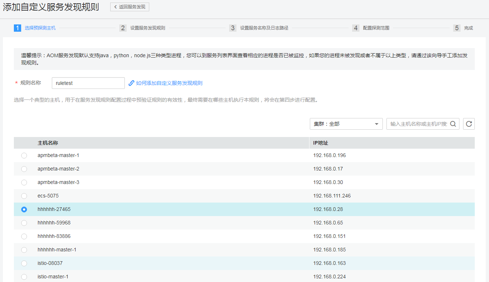
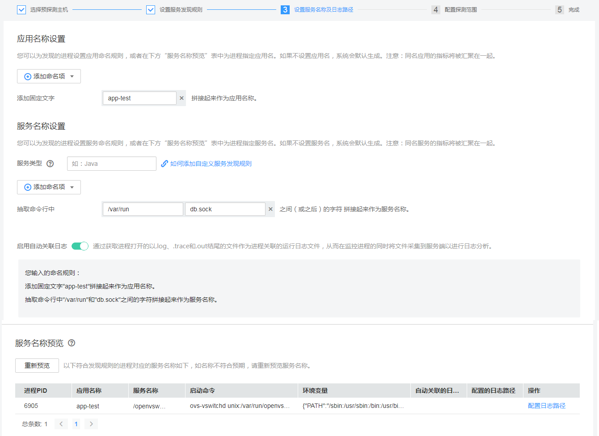
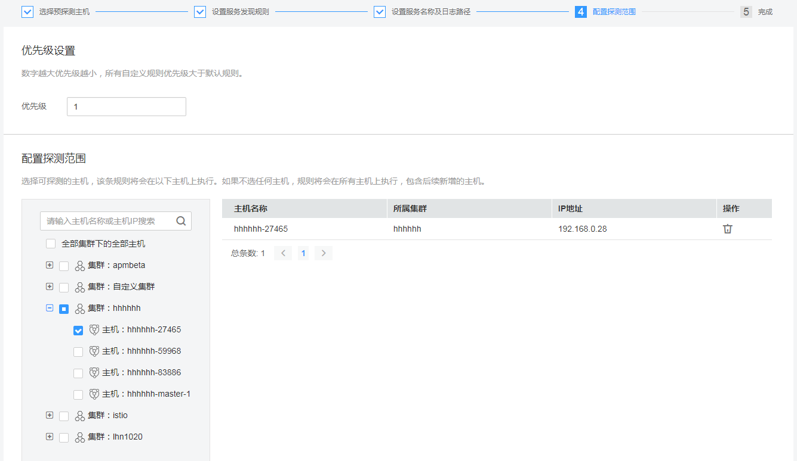

# 配置服务发现<a name="aom_02_0023"></a>

服务发现是指AOM通过配置的规则发现和收集您主机上部署的服务和关联的指标。您可在“服务列表”界面和“指标监控”界面查看发现的服务和服务对应的指标数据。从是否需要您来操作的角度区分服务发现方式，则有两种，自动发现和手动配置。本章节介绍手动配置操作。

-   **自动发现**：通过[内置服务发现规则](#section938317591962)（即Sys\_Rule和Default\_Rule）自动发现。

    您的主机安装ICAgent后，ICAgent会根据内置服务发现规则发现主机上的服务，并呈现在“服务列表”界面。

-   **手动配置**：通过[自定义服务发现规则](#section313122314222)发现。

    您可在“服务发现”界面添加一条自定义的服务发现规则，并应用至已安装ICAgent的主机上，ICAgent会根据您配置的服务发现规则发现主机上的服务，并呈现在“服务列表”界面。


## 服务发现规则优先级<a name="section131712217484"></a>

Sys\_Rule \> 自定义服务发现规则 \> Default\_Rule

例如，主机上的进程同时满足内置服务发现规则（Sys\_Rule和Default\_Rule）和自定义服务发现规则，则优先在主机上执行Sys\_Rule，不执行自定义服务发现规则和Default\_Rule。

## 内置服务发现规则<a name="section938317591962"></a>

AOM提供了Sys\_Rule和Default\_Rule两个内置的服务发现规则，内置的服务发现规则会在所有主机上执行，包括后续新增的主机。其中Sys\_Rule优先级大于Default\_Rule，即优先在主机上执行Sys\_Rule，如果满足Sys\_Rule，则不执行Default\_Rule，如果不满足Sys\_Rule，则执行Default\_Rule。规则内容如下：

**Sys\_Rule**（不能停用）

-   服务名优先取命令行“-Dapm\_tier”的值，其次取环境变量“PAAS\_APP\_NAME”的值，最后取环境变量“JAVA\_TOOL\_OPTIONS”中“-Dapm\_tier”的值。
-   应用名优先取命令行“-Dapm\_application”的值，其次取环境变量“PAAS\_MONITORING\_GROUP”的值，最后取环境变量“JAVA\_TOOL\_OPTIONS”中“-Dapm\_application”的值。

如下示例所示，则服务名为atps-demo，应用名为atpd-test。

```
PAAS_MONITORING_GROUP=atpd-test
PAAS_APP_NAME=atps-demo
JAVA_TOOL_OPTIONS=-javaagent:/opt/oss/servicemgr/ICAgent/pinpoint/pinpoint-bootstrap.jar -Dapm_application=atpd-test -Dapm_tier=atps-demo
```

**Default\_Rule**（可停用）

-   如果进程的“COMMAND”列的值为“java”，则服务名依次按照优先级从命令行中的jar包名、命令行中主类名、命令行中第一个非-开头的关键字获取，应用名使用默认值unknownapplicationname。
-   如果进程的“COMMAND”列的值为“python”，则服务名取命令行中第一个py/pyc脚本名，应用名使用默认值unknownapplicationname。
-   如果进程的“COMMAND”列的值为“node”，则服务名取命令行中第一个js脚本名，应用名使用默认值unknownapplicationname。

## 自定义服务发现规则<a name="section313122314222"></a>

1.  登录AOM控制台，在左侧导航栏中选择“应用监控 \> 服务发现”。
2.  单击右上角的“添加自定义服务发现规则”，配置服务发现规则。
3.  选择预探测主机。

    1.  自定义一个规则规则名称（例如，ruletest）。
    2.  选择一个典型的主机（例如，hhhhhh-27465），用于在服务发现规则配置过程中预验证规则的有效性，最终在哪些主机上执行本规则，将会在[6](#li1434613512472)进行配置。完成后单击“下一步”。

    **图 1**  选择预探测主机<a name="fig15431815183410"></a>  
    

4.  设置服务发现规则。

    1.  单击“添加检查项”，使满足检查项的进程能被AOM发现。

        AOM将发现满足检查项的进程，例如，命令行参数包含“ovs-vswitchd unix:”，且环境变量中包含“SUDO\_USER=paas”的进程。

        > **说明：**   
        >-   为了能精准的探测到符合您预期的进程，建议您在添加检查项时，填写进程的独有特征，即填写更容易识别出预期进程的关键字作为检查项。  
        >-   您至少要添加一条检查项，检查项您最多可添加5条。当有多条检查项时，所有检查项同时满足，AOM才能发现进程。  

    2.  添加检查项完成后，单击“开始探测”，查找符合的进程。

        如果20s后未探测到符合条件的进程，您需要修改发现规则后继续探测；如果探测到符合的进程，将可进入下一步的操作，否则不能进入后续操作。

    **图 2**  设置服务发现规则<a name="fig183288514504"></a>  
    

5.  设置应用名称、服务名称及日志路径。

    1.  设置应用名称。

        在“应用名称设置”下单击“添加命名项”，为已发现的进程设置应用名。例如，添加固定文字"app-test"拼接起来作为应用名。

        > **说明：**   
        >-   若您未设置应用名，则应用名默认为unknownapplicationname。  
        >-   当添加了多条命名项时，所有命名项将拼接在一起作为进程的应用名，同名应用的指标将被汇聚在一起。  

    2.  设置服务名称。

        在“服务名称设置”下单击“添加命名项”，为已发现的进程设置服务名。例如，抽取命令行中“/var/run”和“db.sock”之间的字符拼接起来作为服务名。

        > **说明：**   
        >-   服务名称不能以“icagent”开头或以“pinpoint4IC”结尾，否则会导致日志上报失败。  
        >-   如果不设置服务名，则服务名会按照[内置服务发现规则](#section938317591962)默认生成。  
        >-   当您添加了多条命名项时，所有命名项将拼接在一起作为进程的服务名，同名服务的指标将被汇聚在一起。  

    3.  预览应用名称和服务名称。

        若不符合要求，您可在“服务名称预览”表中单击对其重新命名。

    4.  配置日志路径

        如果您已开启“启用自动关联日志”，在服务名称预览表格中的操作列单击“配置日志路径”，对已发现的应用名称、服务名称和日志路径与该条进程的命令行参数进行绑定。

    **图 3**  设置应用名称、服务名称及日志路径<a name="fig7416134461911"></a>  
    

6.  <a name="li1434613512472"></a>设置优先级和探测范围。

    1.  设置优先级：优先级即当有多个规则时，优先使用哪个规则发现服务。您可输入1\~9999，数字越小优先级越高，例如，1优先级最高，9999优先级最小。
    2.  配置探测范围：选择可探测的主机，即已配置规则将会在哪个主机上执行。如果不选任何主机，规则将会在所有主机上执行，包含后续新增的主机。

    **图 4**  设置优先级和探测范围<a name="fig2278174083515"></a>  
    

7.  单击“添加”，完成配置。AOM会采集进程的指标数据。
8.  等待大约两分钟后，您可在左侧导航栏中选择“应用监控 \> 服务列表”，在集群下拉列表框中选择主机（例如，hhhhhh-27465），找到已被监控的服务（例如，/openvswitch/）。

## 过滤规则<a name="section456612715916"></a>

ICAgent会在目标主机上执行**ps -e -o pid,comm,lstart,cmd | grep -v defunct**命令，查出目标主机的所有进程。然后将每一个进程分别与过滤规则（过滤规则详见[表1](#table11580171542711)）进行匹配。如果进程满足过滤规则，则进程会被过滤掉，不会被AOM发现；如果进程不满足过滤规则，则进程不会被过滤，会被AOM发现。

执行**ps -e -o pid,comm,lstart,cmd | grep -v defunct**命令后显示类似如下回显信息：

```
[paas@Local_host aom]$ ps -e -o pid,comm,lstart,cmd | grep -v defunct
   PID COMMAND                          STARTED CMD
     1 systemd         Tue Oct  2 21:12:06 2018 /usr/lib/systemd/systemd --switched-root --system --deserialize 20
     2 kthreadd        Tue Oct  2 21:12:06 2018 [kthreadd]
     3 ksoftirqd/0     Tue Oct  2 21:12:06 2018 (ksoftirqd/0)
  1140 tuned           Tue Oct  2 21:12:27 2018 /usr/bin/python -Es /usr/sbin/tuned -l -P
  1144 sshd            Tue Oct  2 21:12:27 2018 /usr/sbin/sshd -D
  1148 agetty          Tue Oct  2 21:12:27 2018 /sbin/agetty --keep-baud 115200 38400 9600 hvc0 vt220
  1154 docker-containe Tue Oct  2 21:12:29 2018 docker-containerd -l unix:///var/run/docker/libcontainerd/docker-containerd.sock --shim docker-containerd-shim --start-timeout 2m --state-dir /var/run/docker/libcontainerd/containerd --runtime docker-runc --metrics-interval=0
```

**表 1**  过滤规则

<a name="table11580171542711"></a>
<table><thead align="left"><tr id="row05811415192713"><th class="cellrowborder" valign="top" width="50%" id="mcps1.2.3.1.1"><p id="p19581201512719"><a name="p19581201512719"></a><a name="p19581201512719"></a>过滤规则</p>
</th>
<th class="cellrowborder" valign="top" width="50%" id="mcps1.2.3.1.2"><p id="p5581131592715"><a name="p5581131592715"></a><a name="p5581131592715"></a>举例</p>
</th>
</tr>
</thead>
<tbody><tr id="row65811915192718"><td class="cellrowborder" valign="top" width="50%" headers="mcps1.2.3.1.1 "><p id="p1125615175374"><a name="p1125615175374"></a><a name="p1125615175374"></a>如果进程的“COMMAND”列的值为“docker-containe”、“vi”、“vim”、“pause”、“sshd”、“ps”、“sleep”、“grep”、“tailf”、“tail”或“systemd-udevd”，且为非容器内的进程，则该类进程会被过滤掉，不会被AOM发现。</p>
</td>
<td class="cellrowborder" valign="top" width="50%" headers="mcps1.2.3.1.2 "><p id="p6581015182712"><a name="p6581015182712"></a><a name="p6581015182712"></a>例如，上面回显信息中“PID”为“1154”的进程，因为其“COMMAND”列的值为“docker-containe”，所以该进程不会被AOM发现。</p>
</td>
</tr>
<tr id="row135811015152716"><td class="cellrowborder" valign="top" width="50%" headers="mcps1.2.3.1.1 "><p id="p6564173123715"><a name="p6564173123715"></a><a name="p6564173123715"></a>如果进程的“CMD”列的值以“[”开头，且以“]”结尾，则该类进程会被过滤掉，不会被AOM发现。</p>
</td>
<td class="cellrowborder" valign="top" width="50%" headers="mcps1.2.3.1.2 "><p id="p16581191562720"><a name="p16581191562720"></a><a name="p16581191562720"></a>例如，上面回显信息中“PID”为“2”的进程，因为其“CMD”列的值为“[kthreadd]”，所以该进程不会被AOM发现。</p>
</td>
</tr>
<tr id="row1758112151274"><td class="cellrowborder" valign="top" width="50%" headers="mcps1.2.3.1.1 "><p id="p836884693713"><a name="p836884693713"></a><a name="p836884693713"></a>如果进程的“CMD”列的值以“(”开头，且以“)”结尾，则该类进程会被过滤掉，不会被AOM发现。</p>
</td>
<td class="cellrowborder" valign="top" width="50%" headers="mcps1.2.3.1.2 "><p id="p8581141592715"><a name="p8581141592715"></a><a name="p8581141592715"></a>例如，上面回显信息中“PID”为“3”的进程，因为其“CMD”列的值为“(ksoftirqd/0)”，所以该进程不会被AOM发现。</p>
</td>
</tr>
<tr id="row2581615122710"><td class="cellrowborder" valign="top" width="50%" headers="mcps1.2.3.1.1 "><p id="p3277356193717"><a name="p3277356193717"></a><a name="p3277356193717"></a>如果进程的“CMD”列的值以“/sbin/”开头，则该类进程会被过滤掉，不会被AOM发现。</p>
</td>
<td class="cellrowborder" valign="top" width="50%" headers="mcps1.2.3.1.2 "><p id="p2033985722711"><a name="p2033985722711"></a><a name="p2033985722711"></a>例如，上面回显信息中“PID”为“1148”的进程，因为其“CMD”列的值以“/sbin/”开头，所以该进程不会被AOM发现。</p>
</td>
</tr>
</tbody>
</table>

## 更多服务发现规则操作<a name="section15472192919223"></a>

服务发现规则添加完成后，您还可以执行[表2](#table62191141172620)中的操作。

**表 2**  相关操作

<a name="table62191141172620"></a>
<table><thead align="left"><tr id="row17219114119268"><th class="cellrowborder" valign="top" width="20%" id="mcps1.2.3.1.1"><p id="p72191641172615"><a name="p72191641172615"></a><a name="p72191641172615"></a>操作</p>
</th>
<th class="cellrowborder" valign="top" width="80%" id="mcps1.2.3.1.2"><p id="p17877452192615"><a name="p17877452192615"></a><a name="p17877452192615"></a>说明</p>
</th>
</tr>
</thead>
<tbody><tr id="row916024412158"><td class="cellrowborder" valign="top" width="20%" headers="mcps1.2.3.1.1 "><p id="p9942201782420"><a name="p9942201782420"></a><a name="p9942201782420"></a>查看服务发现规则详情</p>
</td>
<td class="cellrowborder" valign="top" width="80%" headers="mcps1.2.3.1.2 "><p id="p3942171752410"><a name="p3942171752410"></a><a name="p3942171752410"></a>在“名称”列单击服务发现规则的名称。</p>
</td>
</tr>
<tr id="row14819216131817"><td class="cellrowborder" valign="top" width="20%" headers="mcps1.2.3.1.1 "><p id="p1864185913260"><a name="p1864185913260"></a><a name="p1864185913260"></a>启、停服务发现规则</p>
</td>
<td class="cellrowborder" valign="top" width="80%" headers="mcps1.2.3.1.2 "><a name="ul361510414434"></a><a name="ul361510414434"></a><ul id="ul361510414434"><li>单击“操作”列的“启用”。</li><li>单击“操作”列的“停用”。停用后，AOM将不采集进程的指标数据。</li></ul>
</td>
</tr>
<tr id="row1532855313308"><td class="cellrowborder" valign="top" width="20%" headers="mcps1.2.3.1.1 "><p id="p032817535309"><a name="p032817535309"></a><a name="p032817535309"></a>删除服务发现规则</p>
</td>
<td class="cellrowborder" valign="top" width="80%" headers="mcps1.2.3.1.2 "><a name="ul12428123811137"></a><a name="ul12428123811137"></a><ul id="ul12428123811137"><li>删除一个服务发现规则：在“操作”列的“更多”下拉列表框中选择“删除”。</li><li>删除一个或多个服务发现规则：选中一个或多个服务发现规则前的复选框，单击页面上方的“删除”。</li></ul>
<div class="note" id="note1750471884314"><a name="note1750471884314"></a><a name="note1750471884314"></a><span class="notetitle"> 说明： </span><div class="notebody"><p id="p45051718174313"><a name="p45051718174313"></a><a name="p45051718174313"></a>内置服务发现规则不支持删除操作。</p>
</div></div>
</td>
</tr>
<tr id="row19219204172614"><td class="cellrowborder" valign="top" width="20%" headers="mcps1.2.3.1.1 "><p id="p1321964142617"><a name="p1321964142617"></a><a name="p1321964142617"></a>修改服务发现规则</p>
</td>
<td class="cellrowborder" valign="top" width="80%" headers="mcps1.2.3.1.2 "><p id="p9391161711157"><a name="p9391161711157"></a><a name="p9391161711157"></a>在“操作”列的“更多”下拉列表框中选择“修改”。</p>
<div class="note" id="note8504537204316"><a name="note8504537204316"></a><a name="note8504537204316"></a><span class="notetitle"> 说明： </span><div class="notebody"><p id="p135061137134320"><a name="p135061137134320"></a><a name="p135061137134320"></a>内置服务发现规则不支持修改操作。</p>
</div></div>
</td>
</tr>
</tbody>
</table>

