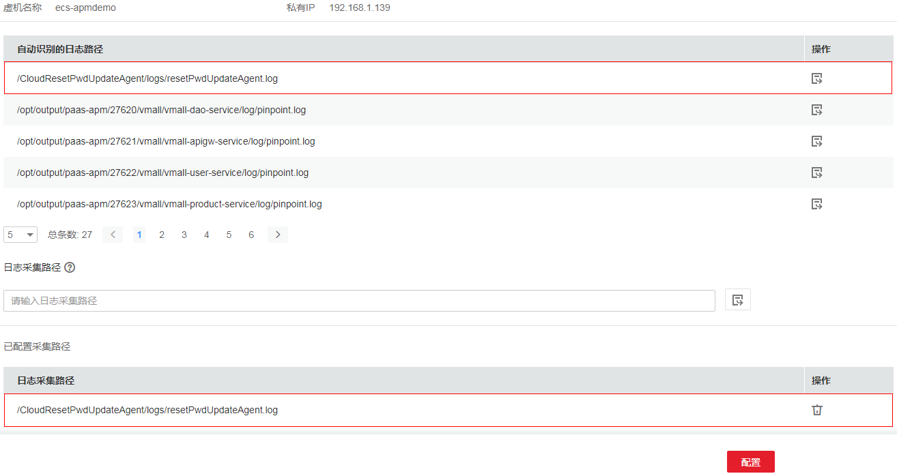
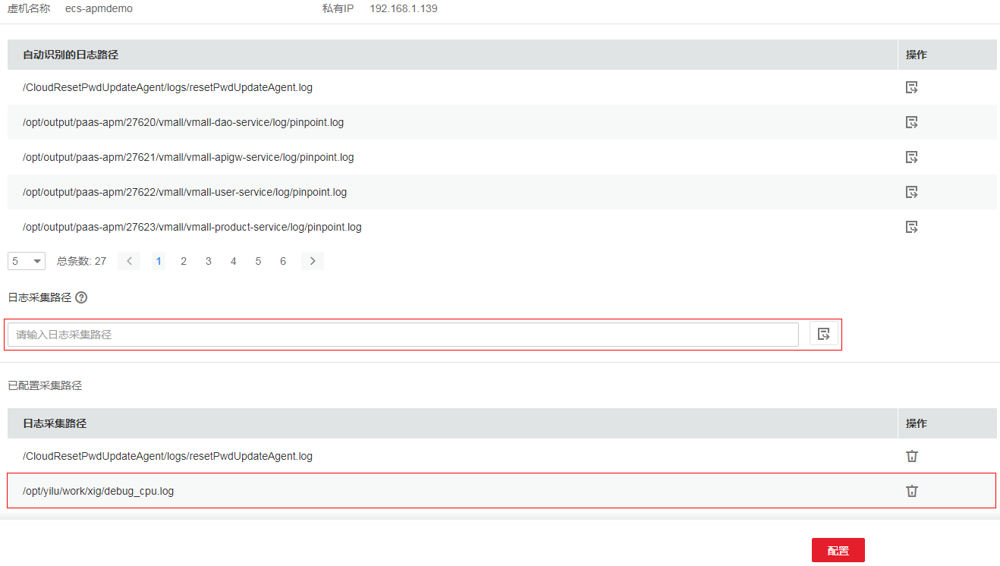
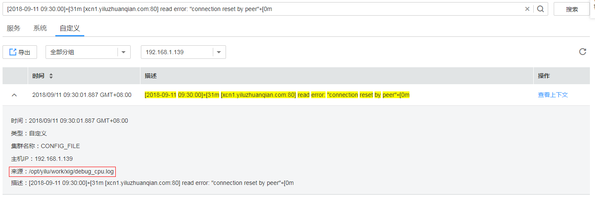

# 配置虚机日志采集路径

AOM支持虚机（这里的虚机指操作系统为Linux的弹性云服务器或裸金属服务器）日志采集，即采集您自定义的日志文件并展现在AOM界面中，以供您检索。使用该功能首先要配置日志采集路径，配置方法详见如下操作。

## 前提条件

您需先为您的虚机安装ICAgent，详见[安装ICAgent](https://support.huaweicloud.com/usermanual-aom/aom_02_0012.html)。ICAgent安装成功后，大概需要5分钟，您即可在“日志管理 \> 路径配置”的虚机列表中查看到您的虚机。

## 使用限制

-   ICAgent只采集\*.log、\*.trace和\*.out类型的日志文件，请确保日志文件后缀为.log、.trace或.out。例如，/opt/yilu/work/xig/debug\_cpu.log。
-   请确保配置的路径是日志目录或文件的绝对路径，且该路径是实际存在的。例如，/opt/yilu/work/xig或/opt/yilu/work/xig/debug\_cpu.log。
-   ICAgent不支持采集下级目录的日志文件。例如，/opt/yilu/work/xig的下级目录为/opt/yilu/work/xig/debug，则ICAgent不采集/opt/yilu/work/xig/debug中的日志文件。
-   一个虚机最多可配置20条日志采集路径。

## 配置方式介绍

AOM支持通过界面和命令方式配置日志采集路径，您可根据需求灵活选择。

-   界面方式：通过界面配置单个或多个虚机的单条或多条日志采集路径。如需配置多条日志采集路径，推荐此方式。
-   命令方式：在虚机服务的启动脚本中增加日志采集路径参数。如果使用此方式，请确保已配置服务发现规则使AOM发现了此虚机服务，即在“应用监控 \> 服务列表”界面列表中可查看到此虚机服务。[如何配置服务发现规则](配置服务发现.md)

## 界面方式-单虚机

1.  登录[应用运维管理](https://console.huaweicloud.com/aom/#/aom/ams/summary)。
2.  在左侧导航栏中选择“日志管理 \> 路径配置”，在虚机列表中单击虚机所在行“操作”列的“配置”。
3.  配置一条或多条日志采集路径。

    您既可使用ICAgent自动识别的路径，也可手动配置。

    -   **使用ICAgent自动识别的路径**

        ICAgent会自动扫描您虚机的日志文件，自动发现虚机中所有持有文件句柄且类型为\*.log、\*.trace和\*.out的日志文件及其路径，然后呈现在界面中供您选择。

        您可单击ICAgent自动识别路径所在行“操作”列的，将该路径添加到“已配置采集路径”列表中。如需配置多条不同的路径，重复该操作即可。

        

    -   **手动配置**

        若ICAgent自动识别的路径不能满足您的需求时，您也可在“日志采集路径”文本框中输入您指定的日志目录或文件，例如/opt/yilu/work/xig/debug\_cpu.log，并单击，将该路径添加到“已配置采集路径”列表中。如需配置多条不同的路径，重复该操作即可。

        

4.  配置完成后，单击“配置”。

## 界面方式-多虚机

您也可对多个虚机批量配置日志采集路径。例如，当您的某个服务同时部署在多个虚机时，您不用多次重复配置，使用批量配置即可，极大地减少了您的工作量。

1.  登录[应用运维管理](https://console.huaweicloud.com/aom/#/aom/ams/summary)。
2.  在左侧导航栏中选择“日志管理 \> 路径配置”。
3.  为多个虚机批量配置一条或多条日志采集路径。

    在列表中选中一个或多个虚机前的复选框，单击“批量配置”，在“日志采集路径”文本框中输入指定的日志目录或文件，例如/opt/yilu/work/xig/debug\_cpu.log。如需配置多条不同的路径，单击“添加采集路径”。

    

    > **说明：**   
    >若您的虚机已配置过日志采集路径，您又进行了批量配置，则新的路径会追加到已有路径中。  

4.  配置完成后，单击“确定”。

    在虚机列表中，单击虚机所在行“日志采集路径”列的，可查看该虚机已配置的日志采集路径。

## 命令方式

使用该种方式配置日志采集路径时，您需确保您的虚机服务能被AOM发现，否则ICAgent将无法采集日志。

1.  配置服务发现规则，详细操作请参见[配置服务发现](配置服务发现.md)。

    > **说明：**   
    >Java、node.js或python类型的服务，您不用配置发现规则，AOM会自动发现服务。  

2.  在您虚机服务的启动脚本中增加“**-Dlog\_output=**_日志采集路径_”。

    日志采集路径为您指定的日志目录或文件，/opt/yilu/work/xig/debug\_cpu.log。使用该种方式您只能配置一条日志采集路径，下面分别以Java、node.js或python类型的虚机服务为例：

    java -jar /root/testdemo/cloud-simple-ui-1.0.0.jar  **-Dlog\_output=**/opt/yilu/work/xig/debug\_cpu.log

    node tmp.js  **-Dlog\_output=**/opt/yilu/work/xig/debug\_cpu.log

    python tmp-log.py  **-Dlog\_output=**/opt/yilu/work/xig/debug\_cpu.log

## 查看虚机日志

日志采集路径配置成功后，若已配置的路径下存在日志文件，则ICAgent会从已配置的路径中采集日志文件，采集大概需要1分钟，请您耐心等待。待采集完成后，您可执行如下操作：

-   **查看日志文件**

    您可在左侧导航栏中选择“日志管理 \> 日志文件”，在“自定义”页签中查看采集到的日志文件，如下图所示。详细操作请参见[查看日志文件](查看日志文件.md)。

    

-   **查看日志并进行分析**

    您可在左侧导航栏中选择“日志管理 \> 日志搜索”，在“自定义”页签中通过时间范围、关键字、上下文等方式查看采集到的日志并进行分析。详细操作请参见[搜索日志](搜索日志.md)。

    

