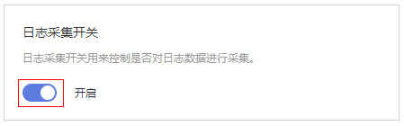

# 采集开关

为了减少内存、数据库、磁盘空间占用，您可以按需进行采集设置。

## 日志采集开关

前提条件：弹性云服务器上已安装ICAgent，详细操作请参见[安装ICAgent](安装ICAgent.md)。

1.  登录AOM控制台，选择“配置管理 \> 日志配置”，选择“采集开关”页签。
2.  开启或者关闭日志采集开关。

    

    > **说明：** 
    >采集开关默认打开，当您不需要采集日志时，可通过关闭采集开关来停止日志采集，以减少资源占用。

